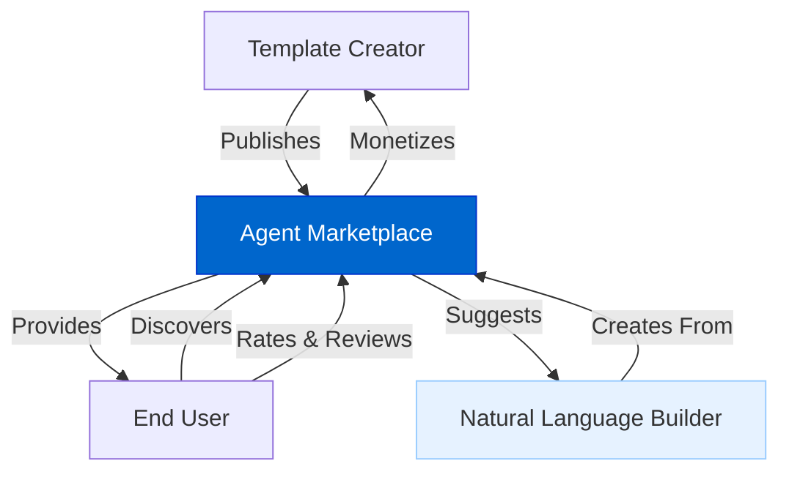
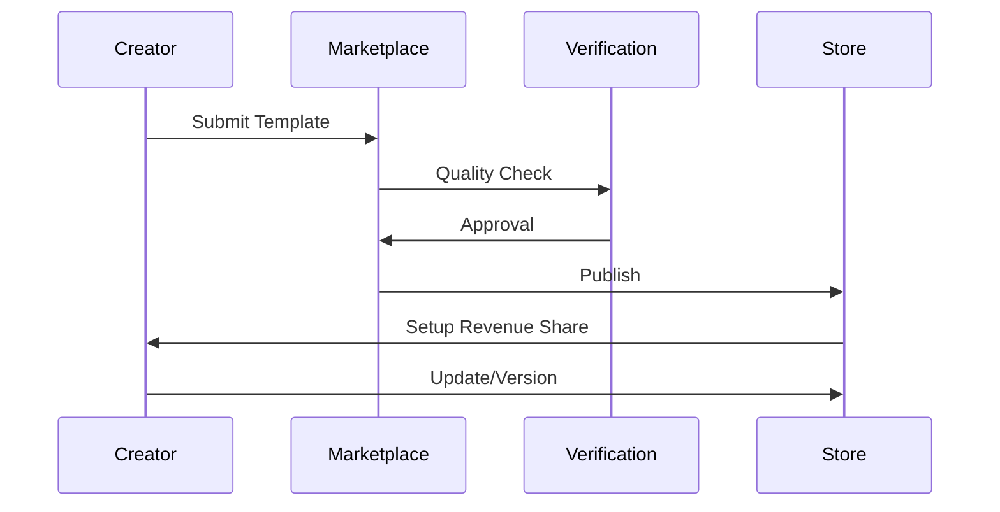
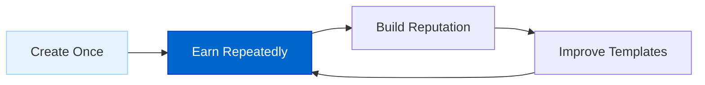
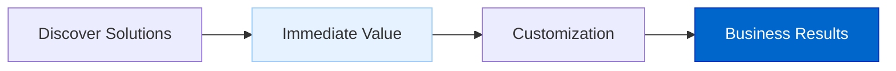
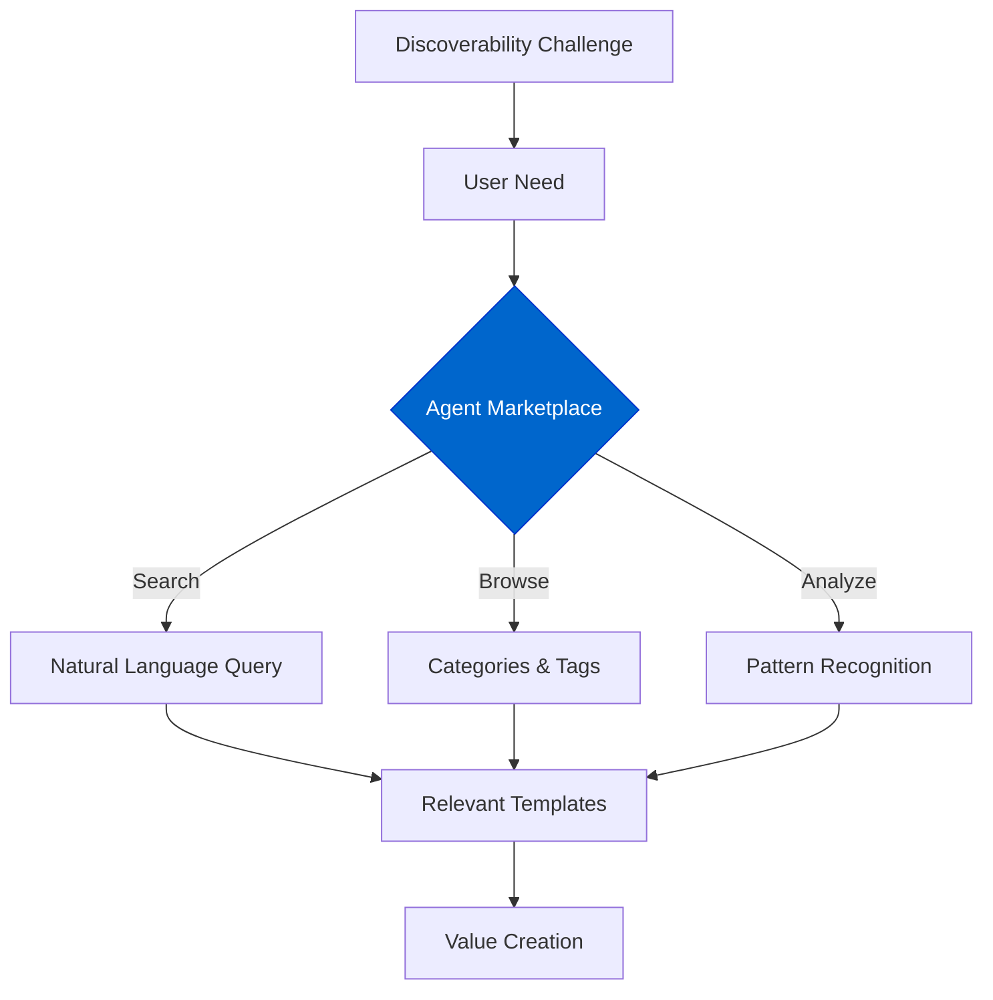
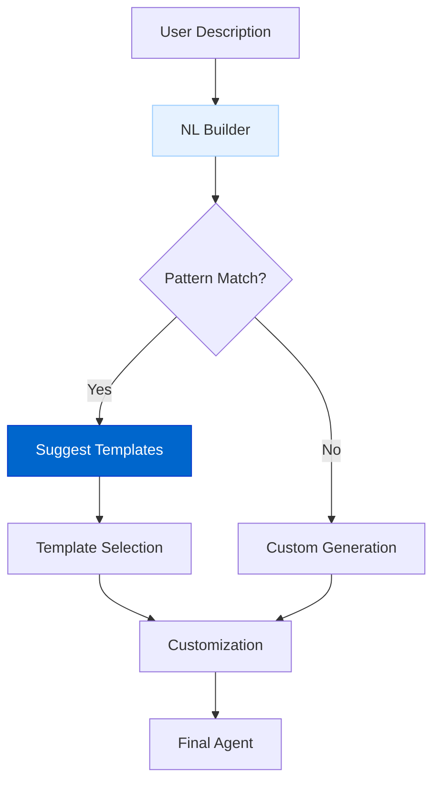

# Agent Marketplace

The Agent Marketplace enables creators to publish, distribute, and monetize their AI agent templates and workflows, while helping users discover high-quality solutions tailored to their needs.

## Current Status

**Status: Planned**

The Agent Marketplace is currently in the design phase, with implementation planned to follow the Natural Language AI Agent Builder.

## Feature Overview

The Agent Marketplace will provide:

- **Template Publishing**: Publish agent templates and workflows for others to use
- **Perpetual Revenue**: Earn ongoing revenue when others use your templates
- **Discovery System**: Find the right templates for specific use cases
- **Quality Ratings**: Community-driven rating and feedback system
- **Version Management**: Update templates while maintaining backward compatibility
- **Integration with NL Builder**: Seamless connection with the Natural Language AI Agent Builder

## Architecture Diagrams

### Marketplace Ecosystem

### Publication Workflow

## Implementation Details

The Agent Marketplace will be implemented through:

### 1. Template Publishing System

The system allows creators to prepare and publish their templates:

- **Metadata Creation**: Add descriptions, categories, and usage examples
- **Version Management**: Control updates while maintaining compatibility
- **Documentation Tools**: Provide clear usage instructions for consumers
- **Analytics Dashboard**: Monitor usage and earnings

### 2. Discovery Engine

The discovery engine helps users find the right templates:

- **Smart Search**: Natural language search for template discovery
- **Category Navigation**: Browse by use case, industry, or function
- **Recommendation System**: AI-powered suggestions based on user needs
- **Similar Templates**: Find alternatives to compare functionality
- **Filter System**: Narrow results by features, ratings, or popularity

### 3. Monetization Framework

The monetization framework enables creators to earn from their work:

- **Revenue Share Model**: Earn a percentage of usage fees
- **Usage Tracking**: Transparent accounting of template usage
- **Flexible Pricing**: Set pricing tiers based on features or volume
- **Promotion Tools**: Highlight your templates to potential users
- **Usage Analytics**: Understand how your templates are being used

## Benefits to the Ecosystem

### For Template Creators

1. **Monetize Expertise**: Turn specialized knowledge into recurring revenue
2. **Reach Users**: Access a broader audience than possible independently
3. **Focus on Quality**: Incentive to create better templates for higher earnings
4. **Build Reputation**: Establish yourself as an expert in specific domains
5. **Feedback Loop**: Gain insights from real-world usage to improve offerings

### For End Users

1. **Specialized Solutions**: Access templates built by domain experts
2. **Time Savings**: Skip building agents from scratch
3. **Quality Assurance**: Use templates vetted by the community
4. **Customization Options**: Adapt templates to specific needs
5. **Consistent Updates**: Benefit from ongoing improvements by creators

### For AgentDock Platform

1. **Expanded Ecosystem**: Growing library of specialized templates
2. **Network Effects**: More creators attract more users and vice versa
3. **Quality Incentives**: Economic rewards for the best templates
4. **Discoverability Solution**: Address the challenge of finding the right agent for specific needs
5. **Ecosystem Growth**: Sustainable model for continuous expansion

## Solving the Discoverability Challenge

A key challenge in AI agent ecosystems is helping users find the right agent for their specific needs:

The Agent Marketplace addresses this challenge by:

1. **Natural Language Understanding**: Converting user needs into relevant template suggestions
2. **Pattern Analysis**: Identifying which templates work best for specific use cases
3. **Community Curation**: Leveraging ratings and reviews to surface quality options
4. **Usage Analytics**: Understanding which templates deliver results in real-world scenarios
5. **Integration with Builder**: Suggesting templates during natural language agent creation

## Example User Journey

### Template Creator
An HR specialist creates an "Employee Onboarding Assistant" template that handles document collection, policy explanations, and IT setup requests. After publishing to the marketplace:

1. The template is discovered by HR departments across multiple organizations
2. Each usage generates revenue for the creator
3. Feedback helps the creator improve the template over time
4. The creator builds a reputation as an HR automation expert
5. The creator develops additional HR templates based on market demand

### Template User
A small business owner needs to automate customer support:

1. Searches the marketplace for "customer support automation"
2. Discovers several templates with ratings and reviews
3. Selects a template that matches their specific needs
4. Customizes the template slightly for their brand voice
5. Deploys a production-ready customer support agent in minutes
6. The original template creator receives compensation

## Integration with Natural Language AI Agent Builder

The Marketplace and NL Builder work together to enhance the agent creation process:

When a user describes an agent they want to create:

1. The Natural Language Builder analyzes the description
2. Pattern matching identifies relevant marketplace templates
3. The user is offered template suggestions as starting points
4. The user can choose a template and customize it or create a custom solution
5. Template creators earn revenue when their templates are selected

## Timeline

| Phase | Description |
|-------|-------------|
| Design | Create marketplace architecture and economic model |
| Alpha | Limited template publishing with manual curation |
| Beta | Public template submissions with automated quality checks |
| Launch | Full monetization and integration with Natural Language Builder |
| Expansion | Advanced analytics and promotional tools for creators |

## Connection to Other Roadmap Items

- **Natural Language AI Agent Builder**: Direct integration for template suggestions
- **AgentDock Pro**: Enterprise marketplace features and private template repositories
- **Multi-Agent Collaboration**: Templates for agent networks and team compositions
- **Evaluation Framework**: Quality metrics for marketplace templates 