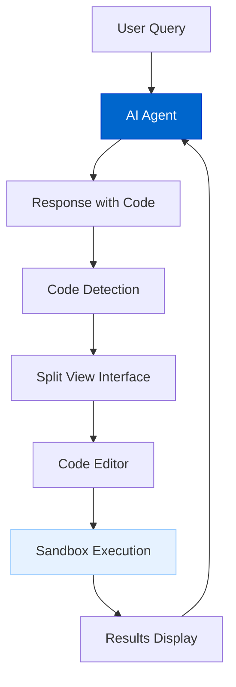
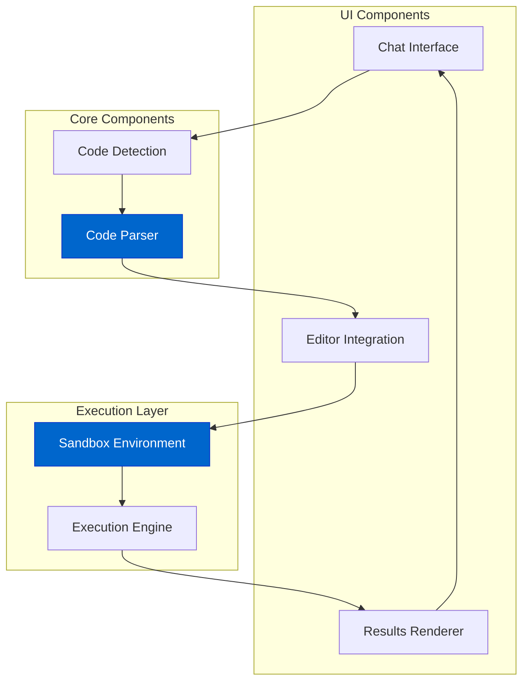
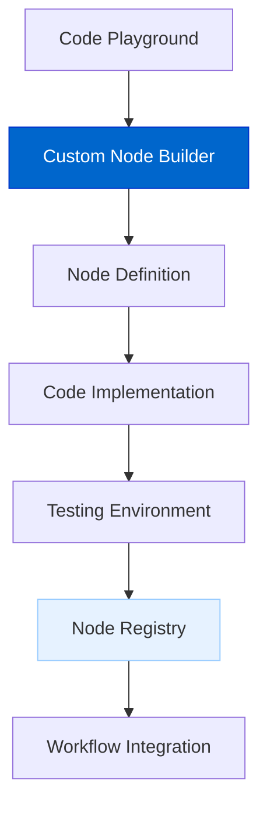
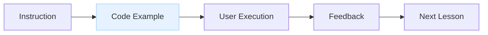
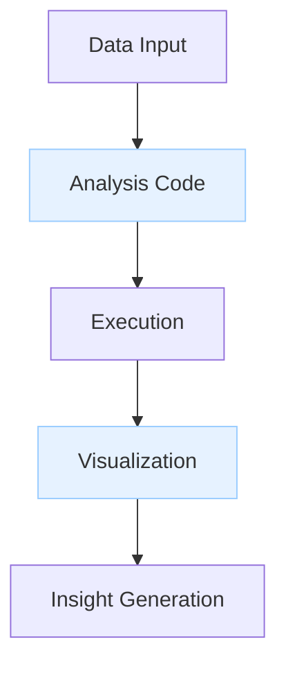
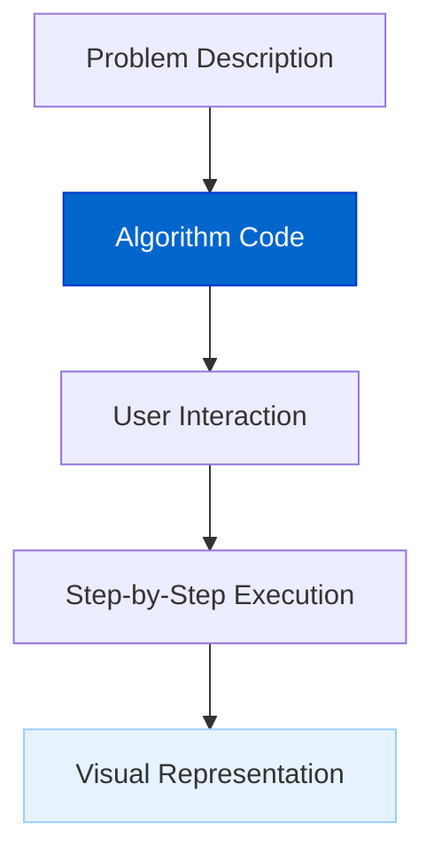
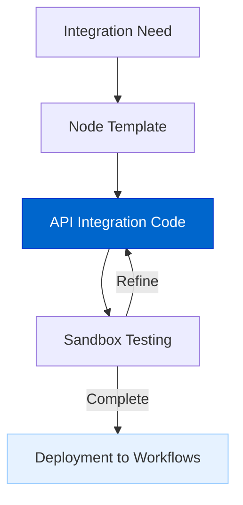

# Code Playground

The Code Playground enables AI agents to generate, execute, and visualize code directly within the chat interface, providing a seamless environment for coding, debugging, and demonstration.

## Current Status

**Status: Planned**

The Code Playground is currently in the design phase, with implementation planned for both OSS and Pro versions.

## Feature Overview

The Code Playground will provide:

- **In-Chat Code Generation**: Create runnable code directly in agent responses
- **Interactive Execution**: Run code and see results without leaving the chat
- **Sandboxed Environment**: Secure code execution in an isolated environment
- **Multi-Language Support**: JavaScript, TypeScript, Python, and more
- **Visual Rendering**: Display charts, tables, and rich visualizations
- **Debugging Tools**: Error highlighting and troubleshooting assistance
- **Version Control**: Track code changes throughout the conversation
- **Custom Node Builder**: Create custom integration nodes for extending platform capabilities

## Architecture Diagrams

### User Experience Flow



### System Architecture



## Implementation Details

The Code Playground will be implemented through:

### 1. Core Components

Code execution and parsing nodes will be added to the AgentDock core:

```typescript
// CodeExecutionNode provides secure code execution
class CodeExecutionNode extends BaseNode {
  async execute({ code, language, timeout = 5000 }) {
    // Execute code in sandbox environment
    // Return results with output/error
  }
}

// CodeParsingNode extracts code blocks from text
class CodeParsingNode extends BaseNode {
  async execute({ text }) {
    // Parse code blocks from text
    // Return segmented content
  }
}
```

### 2. Sandbox Integration

The Sandbox provides secure code execution using Sandpack:

- **Isolated Environment**: Code runs in a secure iframe
- **Resource Limits**: Prevents infinite loops and excessive resource usage
- **Multiple Languages**: Supports JavaScript, TypeScript, Python, and more
- **Dependency Management**: Enables the use of common libraries and frameworks

### 3. UI Implementation

The UI enables seamless code interaction:

- **Split View Interface**: Chat and code side-by-side
- **Code Editor**: Syntax highlighting and autocomplete
- **Results Panel**: Display execution output and visualizations
- **Error Handling**: Highlight errors and suggestions for fixing
- **Visual Controls**: Run, reset, and version control buttons

## Custom Node Builder

A key feature of the Code Playground in AgentDock Pro is the ability to create custom integration nodes, expanding platform capabilities:



### Creating Custom Integrations

The Custom Node Builder empowers users to:

1. **Build Service Connectors**: Create nodes that connect to any third-party API or service
2. **Define Custom Logic**: Implement specialized business logic for unique use cases
3. **Extend Platform Capabilities**: Add functionality not available in built-in nodes
4. **Develop Organization-Specific Tools**: Create private integrations for internal systems

### Implementation Process

```typescript
// Example of a custom integration node created in the Code Playground
export class CustomAPINode extends BaseNode {
  static nodeDefinition = {
    nodeType: 'custom-api-connector',
    title: 'My Custom API',
    description: 'Connects to my organization's API',
    paramSchema: CustomAPISchema
  };
  
  async execute(params) {
    // Connection to custom API
    // Data transformation
    // Error handling
    return processedResults;
  }
}
```

### Key Benefits

- **No External Development Environment**: Build, test, and deploy custom nodes entirely within AgentDock
- **Immediate Testing**: Test custom nodes with real data in the sandbox environment
- **Simplified Deployment**: Register nodes directly to your workspace
- **Version Control**: Track changes and manage versions of custom nodes
- **Sharing**: Share custom nodes within your organization or publish to the marketplace

## Use Cases

### 1. Interactive Tutorials

Create step-by-step coding tutorials with executable examples:



### 2. Data Analysis

Analyze data with code execution and visualization:



### 3. Algorithm Demonstration

Explain algorithms with interactive demonstrations:



### 4. Custom Integration Development

Build and test specialized integration nodes:



## Security Considerations

The Code Playground implements several security measures:

1. **Sandboxed Execution**: All code runs in an isolated environment
2. **Resource Limits**: Execution is constrained by time and memory limits
3. **Restricted Access**: No file system or network access by default
4. **Input Validation**: Code is validated before execution
5. **Output Sanitization**: Results are sanitized before display
6. **Permission Controls**: Custom node capabilities restricted by user permissions

## Integration with AgentDock

The Code Playground integrates with the existing AgentDock architecture:

1. **Node Integration**: Added as specialized nodes in the NodeRegistry
2. **Agent Template**: Specialized template for code-focused agents
3. **UI Enhancement**: Enhanced chat interface with code detection and rendering
4. **Tool System**: Available as tools for any AgentNode
5. **Custom Node Registry**: Manages and tracks user-created integration nodes

## Timeline

| Phase | Description |
|-------|-------------|
| Design | System architecture and component definitions |
| Core Implementation | Build code execution and parsing nodes |
| Sandbox Integration | Implement secure code execution environment |
| UI Development | Create enhanced chat interface with code execution |
| Language Support | Add support for additional programming languages |
| Rich Visualization | Implement data visualization capabilities |
| Custom Node Builder | Develop tooling for creating custom integrations |

## Benefits

1. **Immediate Execution**: Run code examples directly within the chat
2. **Enhanced Learning**: Interactive coding tutorials and demonstrations
3. **Improved Troubleshooting**: Debug issues with direct code execution
4. **Rapid Prototyping**: Test code snippets quickly in conversation
5. **Live Visualization**: See data and algorithm visualizations in real-time
6. **Platform Extension**: Build custom nodes for specific integration needs
7. **Unified Development**: Create, test, and deploy integrations in one environment

## Connection to Other Roadmap Items

- **Evaluation Framework**: Integrates for code quality and performance assessment
- **Natural Language AI Agent Builder**: Can generate code-focused agents
- **Agent Marketplace**: Enable sharing of code-focused agent templates and custom nodes
- **AgentDock Pro**: Enhanced features for collaborative code execution and custom integration development 