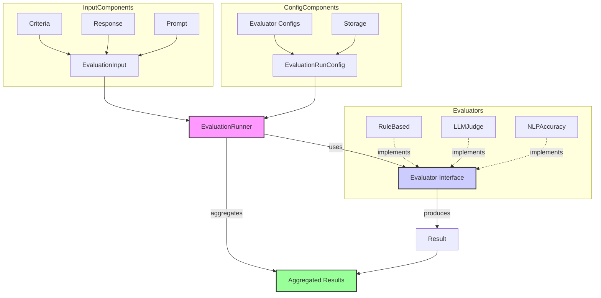
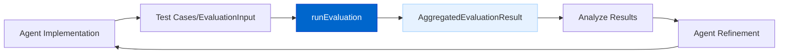

# Agent Evaluation Framework

The Agent Evaluation Framework provides tools for measuring and improving agent performance, ensuring consistent quality across different use cases.

## Current Status

**Status: Phase 1 Implemented**

Phase 1 of the custom AgentDock Core Evaluation Framework has been implemented. This includes the core runner, evaluator interface, storage provider concept, and a suite of initial evaluators (RuleBased, LLMJudge, NLPAccuracy, ToolUsage, Lexical Suite).

## Overview

The framework offers:

- **Extensible Architecture**: Based on a core `Evaluator` interface.
- **Suite of Built-in Evaluators**: Covering rule-based checks, LLM-as-judge, semantic similarity, tool usage, and lexical analysis.
- **Configurable Runs**: Using `EvaluationRunConfig` to select evaluators and criteria.
- **Aggregated Results**: Providing detailed outputs with scores, reasoning, and metadata.
- **Optional Persistence**: Basic file-based logging (`JsonFileStorageProvider`) implemented, with potential for future integration with a Storage Abstraction Layer.

## Architecture (Phase 1 Implementation)

## Implementation Options

A **Custom Implementation** within AgentDock Core was chosen and developed for Phase 1. This provides:

- Full control over the evaluation process.
- Tight integration with AgentDock types (`AgentMessage`, etc.).
- Specific evaluators tailored to agent use cases (e.g., `ToolUsageEvaluator`).
- An extensible base for future enhancements.

Third-party integrations were deferred to allow for a bespoke foundation matching AgentDock's architecture.

## Key Components (Phase 1)

*   **`EvaluationInput`**: Data packet including response, prompt, history, ground truth, context, criteria.
*   **`EvaluationCriteria`**: Defines metrics with name, description, scale, and optional weight.
*   **`Evaluator` Interface**: Core extensibility point (`type`, `evaluate` method).
*   **`EvaluationResult`**: Output per criterion (score, reasoning, type).
*   **`EvaluationRunConfig`**: Specifies evaluators, their configs, optional storage provider, metadata.
*   **`EvaluationRunner`**: Orchestrates the run via `runEvaluation` function.
*   **`AggregatedEvaluationResult`**: Final combined output with overall score (if applicable), individual results, snapshots.
*   **`JsonFileStorageProvider`**: Basic implementation for server-side result logging.

## Key Features (Phase 1)

*   **Rule-Based Checks**: Length, includes, regex, JSON validity.
*   **LLM-as-Judge**: Qualitative assessment via LLM call with templating.
*   **Semantic Similarity**: Cosine similarity using pluggable embedding models (default provided).
*   **Tool Usage Validation**: Checks tool calls, arguments against expectations.
*   **Lexical Analysis**: Similarity (Levenshtein, Dice, etc.), keyword coverage, sentiment (VADER), toxicity (blocklist).
*   **Flexible Input Sourcing**: Evaluators can pull text from `response`, `prompt`, `groundTruth`, or nested `context` fields.
*   **Score Normalization & Aggregation**: Runner attempts to normalize scores to 0-1 and calculate weighted average.
*   **Basic Persistence**: Optional JSONL file logging.
*   **Comprehensive Unit Tests**: Added for core components and evaluators.

## Benefits (Achieved in Phase 1)

1.  **Foundational Quality Assurance**: Basic framework for consistent checks.
2.  **Extensible Base**: Custom evaluators can be built.
3.  **Initial Benchmarking**: Enables comparison of runs via results.
4.  **Concrete Metrics**: Moves beyond subjective assessment for core areas.

## Timeline

| Phase | Status | Description |
|-------|--------|-------------|
| ~~Approach Evaluation~~ | ~~In Progress~~ Completed | ~~Comparing third-party vs. custom solutions~~ Custom solution chosen. |
| ~~Architecture Design~~ | ~~Planned~~ Completed | Phase 1 architecture designed and implemented. |
| Core Implementation | **Completed (Phase 1)** | Basic framework, runner, interface, initial evaluators, storage provider implemented. |
| **Phase 2 / Advanced Features** | **Planned** | See PRD for details (e.g., Advanced evaluator configs, UI integration, enhanced storage, etc.). |

## Use Cases

### Agent Development

Apply evaluations during development to iteratively improve quality:

The implemented Phase 1 framework provides the core capabilities for this loop. Refer to the [Evaluation Framework PRD](../prd/evaluation-framework.md) for detailed usage and Phase 2 plans. 