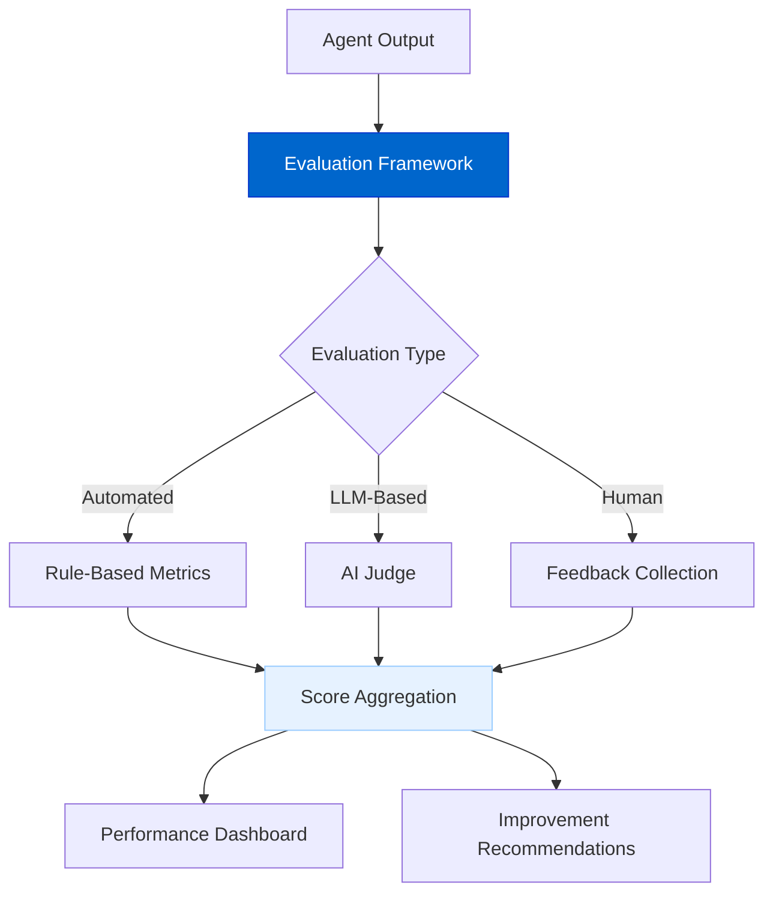
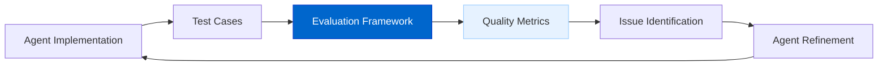

# Agent Evaluation Framework

The Agent Evaluation Framework will provide tools for measuring and improving agent performance, ensuring consistent quality across different use cases.

## Current Status

**Status: Planned**

We're currently evaluating different approaches to implementing the evaluation framework, including both third-party solutions and custom implementations. Regardless of the chosen approach, the framework will include comprehensive assessment capabilities.

## Overview

The framework will offer:

- **Automated Assessment**: Evaluate agent outputs against objective metrics
- **LLM-Based Evaluation**: Use AI to judge response quality, relevance, and accuracy
- **Custom Metrics**: Support for domain-specific evaluation criteria 
- **Feedback Collection**: Gather and analyze user feedback
- **Continuous Improvement**: Track metrics over time to drive enhancements

## Architecture



## Implementation Options

We're exploring two potential approaches:

### 1. Custom Implementation

Building our own evaluation system tailored specifically to AgentDock's needs:

- Full control over evaluation criteria and metrics
- Direct integration with the rest of AgentDock
- Customized reporting for agent-specific insights
- Ability to fine-tune evaluations for specific agent types

A custom implementation would allow us to design the evaluation framework exactly to our specifications, with features like:

```typescript
interface EvaluationResult {
  score: number;         // 0-1 score
  category: string;      // Accuracy, Relevance, etc.
  feedback: string;      // Explanation of score
  timestamp: number;     // When evaluation occurred
  evaluatorType: string; // "auto", "llm", "human"
}

// Define evaluation criteria
const evaluationCriteria = [
  {
    name: 'accuracy',
    description: 'Does the response contain factually correct information?',
    weight: 0.4
  },
  {
    name: 'relevance',
    description: 'Does the response address the user query directly?',
    weight: 0.3
  },
  {
    name: 'completeness',
    description: 'Does the response cover all aspects of the query?',
    weight: 0.3
  }
];
```

### 2. Third-Party Integration

Leveraging open source platforms like Laminar that offer comprehensive evaluation tools:

- Ready-to-use metrics and evaluation pipelines
- Integration with industry-standard observability
- Lower development overhead
- Community-supported extensions

Third-party platforms provide powerful evaluation capabilities that we could integrate with minimal development effort, while still allowing for customization where needed.

For more on how this connects to our telemetry approach, see the [Telemetry & Observability](./telemetry.md) document.

## Key Components

### Evaluation Criteria

The framework will include standard evaluation criteria such as:

- **Accuracy**: Factual correctness of information
- **Relevance**: Alignment with user query
- **Comprehensiveness**: Completeness of the response
- **Helpfulness**: Practical utility to the user
- **Safety**: Avoidance of harmful content
- **Clarity**: Ease of understanding

### Evaluation Methods

Multiple evaluation approaches will be supported:

1. **Automated Rule-Based**:
   - Pattern matching
   - Statistical analysis
   - Keyword detection
   - Syntax/grammar checking

2. **LLM-Based**:
   - LLM-as-a-judge evaluations
   - Comparative assessments
   - Multi-perspective evaluation

3. **Human Feedback**:
   - Rating interfaces
   - Annotation tools
   - A/B testing

### Reporting Dashboard

Results will be available through:

- Interactive performance dashboards
- Historical trend analysis
- Per-agent and cross-agent comparisons
- Exportable reports for further analysis

## Benefits

The Agent Evaluation Framework will provide:

1. **Quality Assurance**: Ensure agent responses meet consistent standards
2. **Informed Development**: Direct development efforts to address identified weaknesses
3. **Benchmarking**: Compare agent performance across versions and types
4. **User Trust**: Build confidence by demonstrating measurable quality
5. **Continuous Improvement**: Establish feedback loops for ongoing enhancement

## Timeline

| Phase | Status | Description |
|-------|--------|-------------|
| Approach Evaluation | In Progress | Comparing third-party vs. custom solutions |
| Architecture Design | Planned | Define framework based on selected approach |
| Core Implementation | Planned | Basic evaluation capabilities |
| Advanced Features | Future | Enhanced analytics and visualization |

## Use Cases

### Agent Development

Apply evaluations during development to iteratively improve quality:



For information on how evaluation integrates with production monitoring and quality assurance processes, please refer to the [Telemetry & Observability](./telemetry.md) document, which covers these aspects in detail.

The final decision on implementation approach will balance development resources, specific needs of AgentDock agents, and integration with our broader observability strategy. Whether we build our own custom solution or leverage third-party tools, the framework will deliver comprehensive evaluation capabilities that drive continuous improvement of agent performance. 