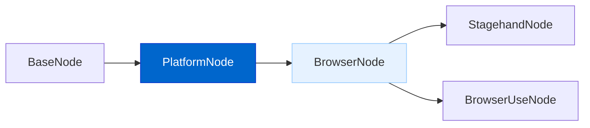
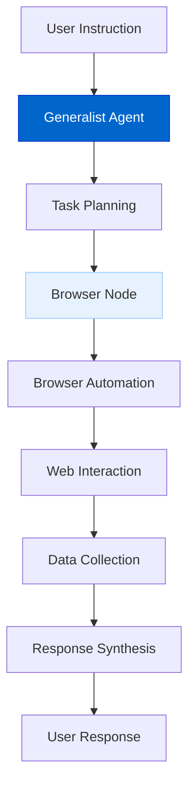
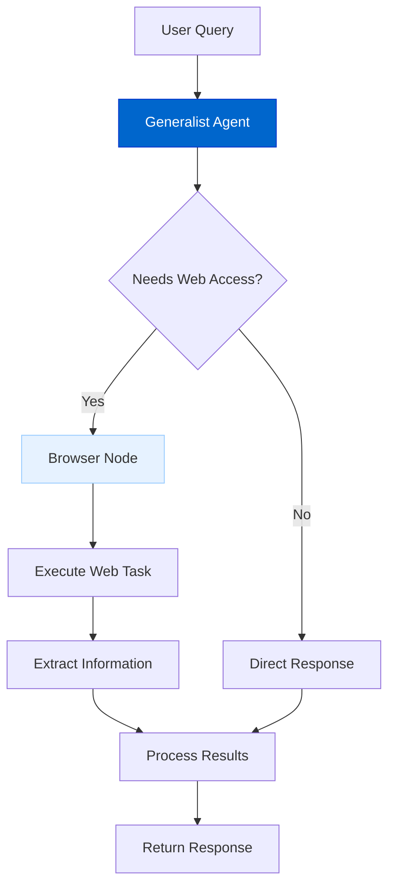
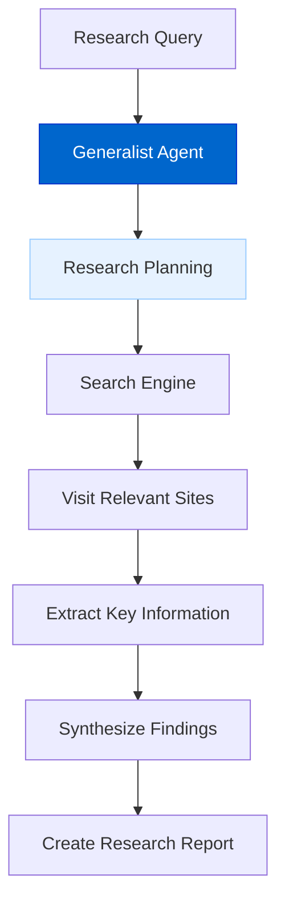
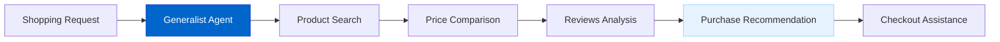
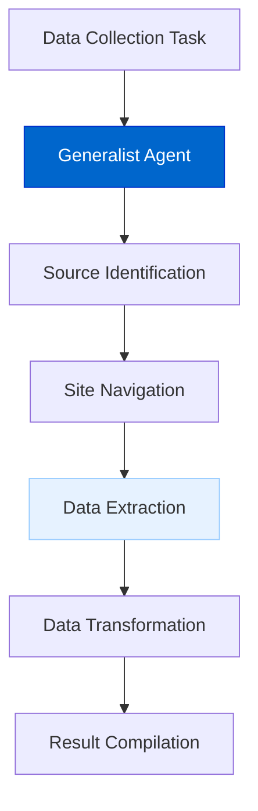

# Generalist AI Agent

The Generalist AI Agent feature enables AgentDock agents to act as versatile web operators capable of autonomously browsing, interacting with websites, and performing complex web-based tasks through natural language instructions.

## Current Status

**Status: Planned**

Development of the Generalist AI Agent system has been designed to leverage modern browser automation tools and integrate them seamlessly with the existing AgentDock architecture.

## Feature Overview

The Generalist AI Agent feature will provide:

- **Web Automation**: Control browser interactions to navigate websites and perform tasks
- **Internet Access**: Search, retrieve, and synthesize information from the web
- **UI Interaction**: Identify and manipulate web elements like buttons, forms, and menus
- **Multimodal Understanding**: Process both visual and text-based web content
- **Task Decomposition**: Break complex instructions into executable subtasks
- **Browser Node Abstraction**: Standard interface extending the PlatformNode architecture

## Architecture Diagrams

### Browser Node Architecture



### Web Task Processing Pipeline



### Generalist Agent Decision Flow



## Implementation Details

The Generalist AI Agent system will be implemented with the following components:

```typescript
// Abstract class for browser-based interactions
abstract class BrowserNode extends PlatformNode {
  // Navigate to a URL
  abstract navigateTo(url: string): Promise<void>;
  
  // Execute action on web page
  abstract executeAction(
    instruction: string, 
    options?: BrowserActionOptions
  ): Promise<BrowserActionResult>;
  
  // Extract data from web page
  abstract extractData(
    instruction: string,
    schema?: DataSchema
  ): Promise<Record<string, any>>;
  
  // Take screenshot of current page
  abstract takeScreenshot(): Promise<Buffer>;
  
  // Initialize browser provider
  abstract initializeBrowserProvider(config: BrowserProviderConfig): Promise<void>;
}

// Configuration for browser providers
interface BrowserProviderConfig {
  provider: 'stagehand' | 'browseruse';
  apiKey?: string;
  headless?: boolean;
  timeout?: number;
  proxyConfig?: ProxyConfig;
}
```

## Browser Provider Support

The system will integrate with leading browser automation tools:

1. **Stagehand**: AI-powered web browsing framework with simplicity and extensibility
2. **Browser Use**: Open-source tool to make websites accessible to AI agents

## Integration Methods

### Stagehand Integration

```typescript
// Example of creating a Stagehand browser node
import { createStagehandNode } from '@/lib/browser/stagehand-factory';

// Create a Stagehand browser node with an existing agent
const browserNode = createStagehandNode('browser-1', agentNode, {
  provider: 'stagehand',
  apiKey: process.env.STAGEHAND_API_KEY!,
  headless: true
});

// Navigate to a website
await browserNode.navigateTo('https://www.example.com');

// Execute an action using natural language
const result = await browserNode.executeAction('Click on the signup button');
```

### Browser Use Integration

```typescript
// Example of creating a Browser Use node
import { createBrowserUseNode } from '@/lib/browser/browseruse-factory';

// Create a Browser Use node with an existing agent
const browserNode = createBrowserUseNode('browser-2', agentNode, {
  provider: 'browseruse',
  headless: false,
  timeout: 30000
});

// Extract data from a website
const data = await browserNode.extractData(
  'Extract all product names and prices from this page',
  {
    productName: 'string',
    price: 'number'
  }
);
```

## Key Features

### Autonomous Web Navigation

The system enables agents to navigate the web like a human user:

- **Natural Language Control**: Control browsers with plain English instructions
- **Intelligent Element Detection**: Identify the right elements to interact with
- **Context Awareness**: Maintain state and context between navigation steps
- **Error Recovery**: Automatically recover from navigation errors

### Multi-provider Flexibility

Select the right browser automation technology based on your needs:

- **Stagehand**: Excellent for complex workflows and detailed page manipulation
- **Browser Use**: Great for quick web access and information retrieval

### Advanced Web Capabilities

Power your agents with sophisticated web abilities:

- **Form Filling**: Complete registration and checkout forms
- **Data Extraction**: Scrape and structure information from websites
- **Multi-tab Management**: Handle multiple concurrent browser sessions
- **Screenshot Capture**: Take screenshots for visual verification

## Benefits

The Generalist AI Agent feature delivers several important benefits:

1. **Versatility**: Handle a wide range of web-based tasks
2. **Efficiency**: Automate repetitive web interactions
3. **Integration**: Connect with external web services without APIs
4. **Accessibility**: Access web information that's not available via APIs
5. **Problem-solving**: Tackle complex multi-step web tasks

## Timeline

| Phase | Status | Description |
|-------|--------|-------------|
| Design & Architecture | Planned | Core architecture design |
| Browser Node Abstract Class | Planned | Base class implementation |
| Stagehand Integration | Planned | Initial browser provider |
| Browser Use Integration | Planned | Additional browser provider |
| Generalist Agent Implementation | Planned | Core agent capabilities |
| Advanced Web Capabilities | Future | Enhanced web interaction features |

## Connection to Other Roadmap Items

The Generalist AI Agent feature connects with other roadmap items:

- **Platform Integration**: Extends the platform node architecture for web browsing
- **Advanced Memory Systems**: Provides context for multi-step web tasks
- **Voice AI Agents**: Combine voice and web capabilities for multimodal agents
- **Agent Marketplace**: Share web agent templates with specific capabilities

## Use Cases

### Web Research Assistant

Conduct comprehensive web research across multiple sources:



### E-commerce Shopping Assistant

Help users find products, compare options, and complete purchases:



### Data Collection Agent

Automatically gather and structure data from multiple web sources:

