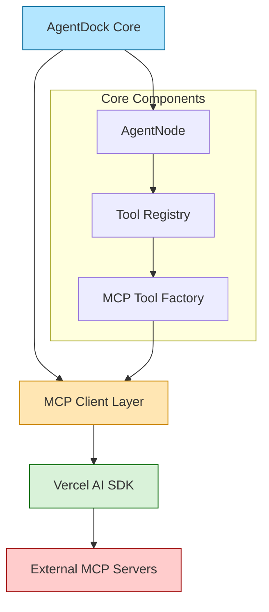
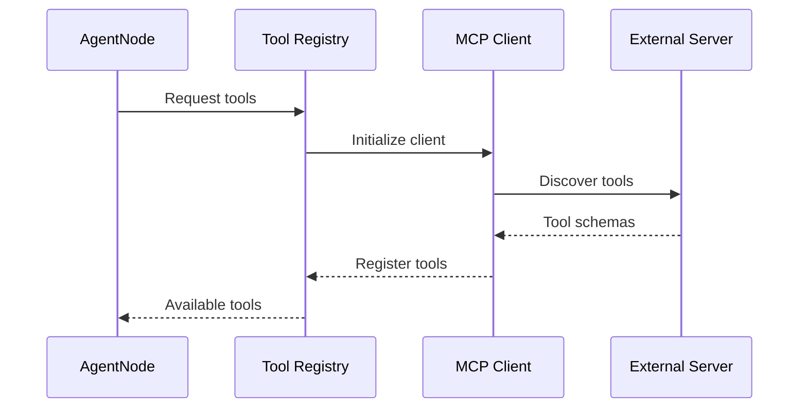
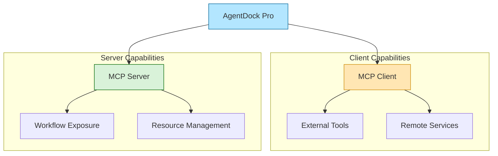

# Model Context Protocol (MCP) Integration

## Status: Planned

## Overview

AgentDock Core will integrate the Model Context Protocol (MCP) to enable standardized tool discovery and execution across different AI agents and services. This integration will allow AgentDock agents to leverage external tools while maintaining our core architecture principles.

## Architecture



## Implementation Strategy

### Phase 1: Core MCP Client Integration

1. **MCP Client Layer**
   - Utilize Vercel AI SDK's built-in MCP client capabilities
   - Create a standardized interface for tool discovery and execution
   - Maintain compatibility with existing node-based architecture

2. **Tool Registry Integration**
   ```typescript
   interface MCPToolConfig {
     transport: {
       type: 'stdio' | 'sse';
       command?: string;
       args?: string[];
       url?: string;
     };
     schemas?: Record<string, any>;
   }
   ```

3. **Agent Configuration**
   ```json
   {
     "nodes": ["llm.anthropic", "mcp.cursor"],
     "nodeConfigurations": {
       "llm.anthropic": {
         "model": "claude-3-sonnet-20240229"
       },
       "mcp.cursor": {
         "transport": {
           "type": "stdio",
           "command": "cursor-tools"
         }
       }
     }
   }
   ```

### Tool Discovery Flow



## Core Features

1. **Dynamic Tool Discovery**
   - Automatic tool registration from MCP servers
   - Schema validation for tool inputs/outputs
   - Runtime tool availability checks

2. **Transport Layer Support**
   - Standard I/O for local tools
   - Server-Sent Events (SSE) for remote tools
   - Extensible transport system

3. **Error Handling**
   - Graceful fallbacks for unavailable tools
   - Clear error messages for configuration issues
   - Connection retry mechanisms

## Usage Examples

### Local Tool Integration
```typescript
// Example: Using Cursor Tools via MCP
const config = {
  transport: {
    type: 'stdio',
    command: 'cursor-tools',
    args: ['browser', 'open']
  }
};

await agent.registerMCPTools(config);
```

### Remote Tool Integration
```typescript
// Example: Using Remote MCP Server
const config = {
  transport: {
    type: 'sse',
    url: 'https://mcp-server.example.com/sse'
  },
  schemas: {
    'get-weather': {
      parameters: {
        location: { type: 'string' }
      }
    }
  }
};

await agent.registerMCPTools(config);
```

## Security Considerations

1. **Tool Validation**
   - Schema validation for all tool inputs
   - Sanitization of command arguments
   - Resource usage limits

2. **Transport Security**
   - TLS for remote connections
   - Local tool execution sandboxing
   - Access control for sensitive operations

## Future Enhancements

1. **Tool Caching**
   - Cache tool schemas for faster startup
   - Periodic schema refresh
   - Offline mode support

2. **Advanced Features**
   - Tool composition and chaining
   - Custom transport layers
   - Enhanced error recovery

## Pro Features Preview

AgentDock Pro will extend the MCP integration with advanced capabilities:



- **Dual-Role Architecture**: Function as both MCP client and server
- **Workflow Exposure**: Share workflows as MCP resources
- **Enhanced Resource Management**: Advanced control over exposed capabilities
- **Cross-Workflow Integration**: Compose workflows using MCP protocol

*(More details coming soon in Pro documentation)*

## Development Timeline

1. **Phase 1: Core Integration** (Current)
   - [x] Design architecture
   - [ ] Implement MCP client layer
   - [ ] Add tool registry support
   - [ ] Basic transport layers

2. **Phase 2: Enhanced Features**
   - [ ] Advanced error handling
   - [ ] Tool caching system
   - [ ] Security improvements

3. **Phase 3: Optimization**
   - [ ] Performance improvements
   - [ ] Extended transport options
   - [ ] Developer tooling