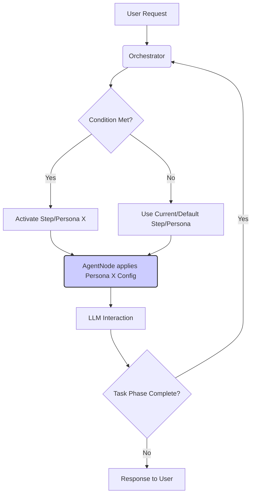
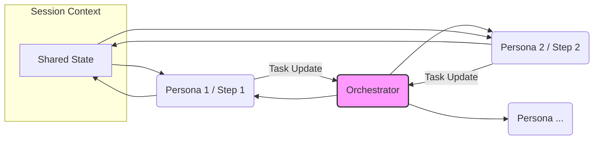

# Multi-Agent Collaboration

## Current Status

**Status: Planned**

This document outlines the planned approach for enabling multiple specialized agents or agent personas to collaborate on tasks within a single user session in AgentDock.

## Goal

To allow complex tasks to be broken down and handled by different specialized agent configurations (personas) sequentially, managed by the orchestration framework, while maintaining a coherent conversational context.

## Core Concept (V1 - Orchestration-Driven Personas)

The initial implementation will leverage the existing **Orchestration Framework**. Instead of just controlling tools, orchestration steps will be used to represent different **agent personas** or **task phases**.

-   **Personas as Steps:** Each step in an orchestration configuration can represent a different specialist (e.g., a "Researcher" step, a "Planner" step, a "Coder" step).
-   **Dynamic Configuration:** When a step/persona becomes active (based on [Conditional Transitions](../architecture/orchestration/conditional-transitions.md)), the system will dynamically apply specific configurations associated with that persona for the next interaction. This could include:
    -   A modified or specialized system prompt.
    -   A distinct set of available tools.
    -   Potentially specific LLM model settings (if feasible).
-   **Sequential Collaboration:** The orchestrator manages the flow, handing off the task context (maintained in the session state) from one persona/step to the next based on predefined conditions. The "collaboration" happens sequentially as the task progresses through different specialist phases.

### Simplified Handoff View

## Architecture & Implementation Approach

This approach aims to minimize initial changes to the core framework:

1.  **Orchestration Configuration (`template.json`):** Extend the step definition to optionally include persona-specific overrides (e.g., `stepSystemPrompt`, potentially overriding `availableTools` more dynamically).
2.  **`AgentNode` Adaptation:** Modify `AgentNode` or the API layer logic that uses it. Before calling `CoreLLM`, it will:
    -   Retrieve the current `OrchestrationState` (including `activeStep`) via `OrchestrationStateManager`.
    -   Check the configuration of the `activeStep`.
    -   Apply any persona overrides from the step config when constructing the prompt and determining the final tool list for the LLM call.
3.  **State Management:** The existing `OrchestrationStateManager` and `SessionManager` will be used to persist the `activeStep` and any shared context needed between steps/personas.

## Benefits

-   Leverages existing orchestration framework.
-   Enables task decomposition across specialized agent configurations.
-   Provides structured, sequential workflow management.
-   Requires relatively minimal initial changes to `agentdock-core`.

## Future Enhancements

-   **Agent-as-a-Tool:** Allow one `AgentNode` instance to directly invoke another `AgentNode` as a tool, enabling more complex, nested interactions.
-   **Shared Scratchpad/Memory:** Introduce a dedicated shared memory space within the session state for agents to explicitly pass complex data or intermediate results.
-   **Concurrent Execution:** Explore models for running multiple agents in parallel for certain tasks.