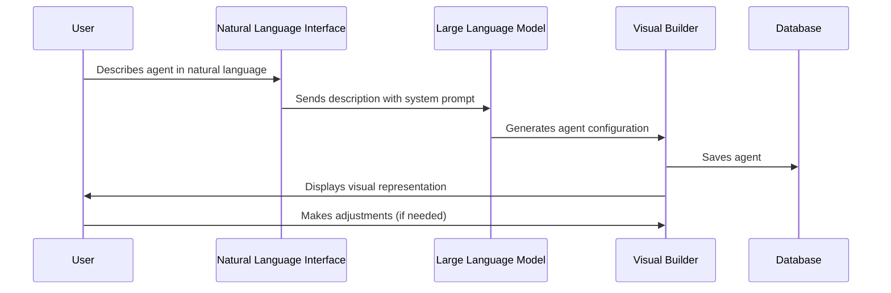
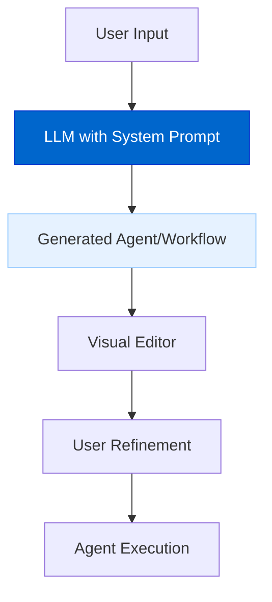
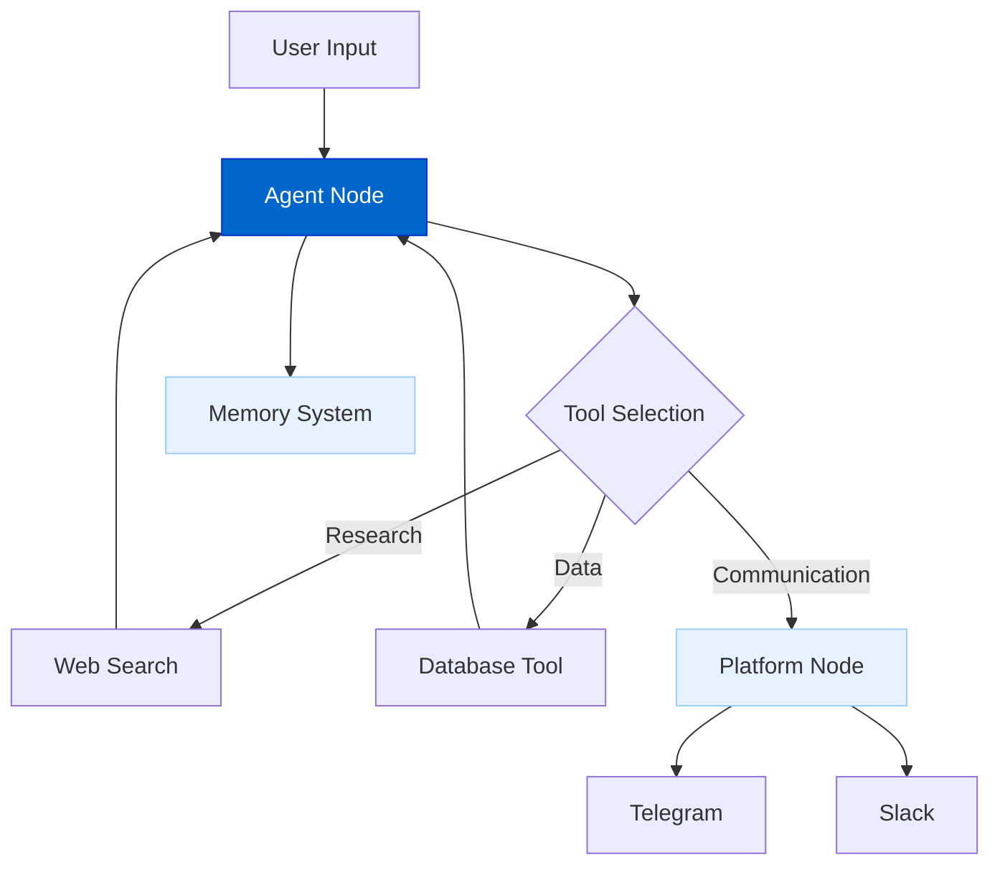
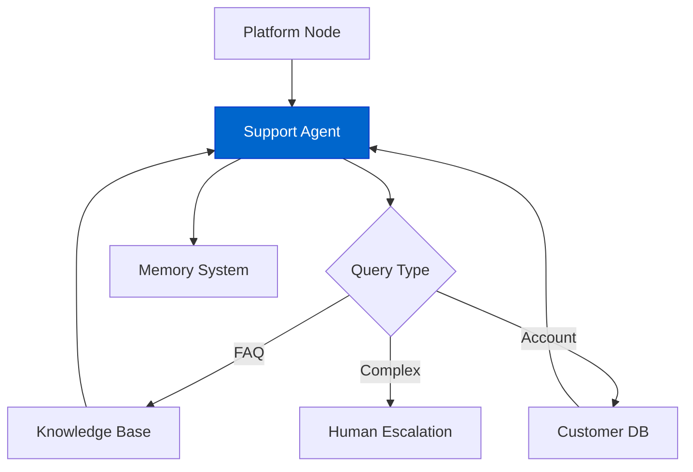
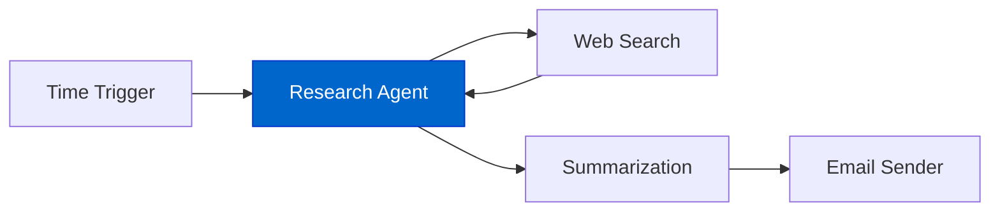
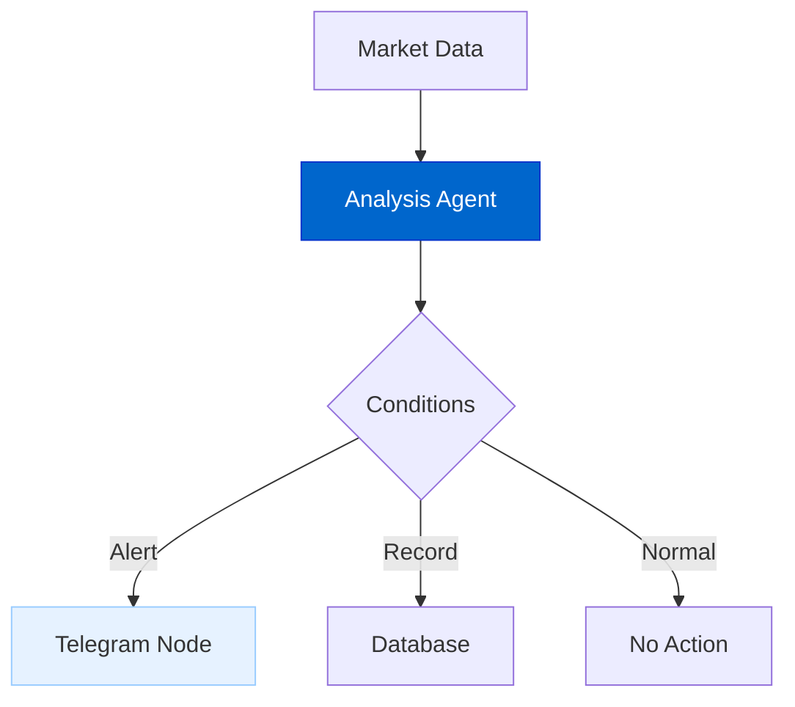
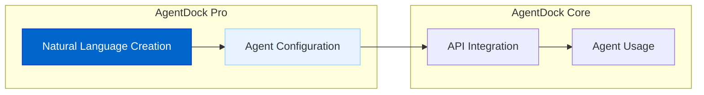

# Natural Language AI Agent Builder

The Natural Language AI Agent Builder allows users to create sophisticated AI agents and workflows using plain language descriptions instead of complex coding or visual programming.

## Current Status

**Status: Planned**

The Natural Language AI Agent Builder is currently in the design phase, with implementation planned for the Pro version.

## Feature Overview

The Natural Language AI Agent Builder will provide:

- **Language-Based Creation**: Describe agents and workflows in your own words
- **Instant Prototyping**: Test your agents immediately after creation
- **Automatic Tool Selection**: Smart configuration of appropriate tools
- **Visual Builder Integration**: Seamless transition between natural language and visual editing
- **Multi-Language Support**: Create agents using any language, not just English
- **Workflow Generation**: Create complex, multi-step workflows through description

## Architecture Diagrams

### Creation Process



### Implementation Architecture



### Agent Example



## Implementation Details

The Natural Language AI Agent Builder will be implemented through:

### 1. System Prompt

A carefully crafted system prompt provides instructions and context to the LLM:

```typescript
const systemPrompt = {
  instruction: `You are an expert agent builder for AgentDock Pro.
  Analyze the user's natural language description and create the optimal agent configuration.`,
  
  availableTools: {
    "webSearch": {
      description: "Searches the web for information",
      inputs: { "query": "string" },
      outputs: { "results": "array" }
    },
    "databaseQuery": {
      description: "Queries databases",
      inputs: { "sql": "string" },
      outputs: { "results": "array" }
    },
    // More tools...
  },
  
  outputFormat: {
    type: "AgentConfiguration",
    example: {
      name: "Research Assistant",
      description: "Helps with research tasks",
      systemPrompt: "You are a research assistant...",
      tools: ["webSearch", "fileSummarizer"]
    }
  }
};
```

### 2. LLM Processing

The LLM analyzes the description to determine:

- Agent's purpose and personality
- Required tools and capabilities
- System prompt for optimal behavior
- Memory requirements
- Appropriate connectors to platforms

### 3. Visual Builder Integration

The generated agent appears in the visual builder for inspection and refinement:

- Node connections automatically created
- Tool configurations pre-populated
- System prompt displayed for editing
- Memory systems attached as needed

## Workflow Examples

### Customer Support Agent

**Natural Language Input:**
"Create an agent that handles customer support requests, can search our knowledge base, and escalates to human agents when necessary."



### Research Assistant Workflow

**Natural Language Input:**
"I need a workflow that researches topics, summarizes findings, and sends daily reports by email."



### Trading Monitor Workflow

**Natural Language Input:**
"Build a workflow that monitors stock prices, analyzes market trends, and alerts me on Telegram when specific conditions are met."



## Key Features

### 1. Multi-Language Support

Create agents in any language:

```
English: "Create a customer support agent with knowledge base access"
Spanish: "Crea un agente de atención al cliente con acceso a la base de conocimientos"
Japanese: "ナレッジベースにアクセスできるカスタマーサポートエージェントを作成する"
```

### 2. Canvas Selection Enhancement

Select specific parts of an existing workflow and modify them with natural language:

```
"Add error handling to this section of the workflow"
"Improve the response formatting for better readability"
"Make this agent more creative in its responses"
```

### 3. Template Integration

The system suggests templates based on your description:

```
Input: "Create an agent that helps with scheduling meetings"
System: "I found these templates that match your needs:
  1. Calendar Assistant
  2. Meeting Coordinator
  3. Executive Assistant"
```

## Integration with AgentDock Core

Core users can access Pro-created agents with API keys:



## Benefits

1. **Accessibility**: Create agents without coding or technical knowledge
2. **Rapid Prototyping**: Move from idea to working agent in minutes
3. **Iterative Development**: Refine your agent through natural conversation
4. **Reduced Cognitive Load**: Focus on what you want, not implementation details
5. **Enhanced Productivity**: Build complex workflows with simple descriptions

## Timeline

| Phase | Status | Description |
|-------|--------|-------------|
| Design | In Progress | System architecture and prompt design |
| Simple Agent Creation | Planned | Basic agent creation from descriptions |
| Tool Integration | Planned | Smart tool selection and configuration |
| Visual Builder Integration | Planned | Combined natural language and visual editing |
| Advanced Workflow Generation | Future | Complex multi-step workflow creation |
| Pattern Learning | Future | Improving generation through successful patterns |

## Connection to Other Roadmap Items

- **Platform Integration**: Easily configure agent connections to platforms
- **Advanced Memory Systems**: Natural language setup of memory requirements
- **Multi-Agent Collaboration**: Describe complex agent interactions
- **Tool Integration**: Automatic tool selection and configuration 