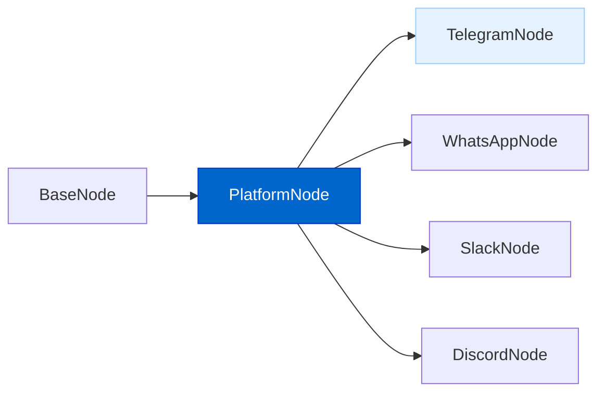
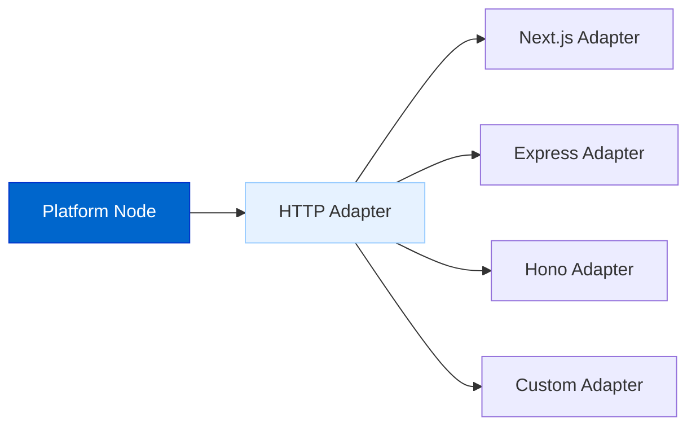
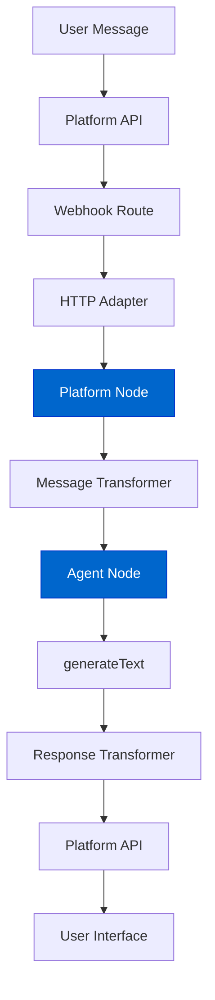

# Platform Integration

The Platform Integration feature extends AgentDock agents to interact with users through external messaging platforms such as Telegram, WhatsApp, and Slack.

## Current Status

**Status: Planned**

Development of the framework-agnostic platform integration system has been designed, with Telegram as the first reference implementation.

## Feature Overview

The Platform Integration will provide:

- **Framework-Agnostic Design**: Core logic that works across different HTTP frameworks
- **Platform Node Abstraction**: Standard interface for implementing platform integrations
- **Webhook Handling**: Robust webhook implementation for real-time updates
- **Message Transformation**: Conversion between platform-specific and AgentDock message formats
- **Conversation Management**: State tracking across user interactions
- **HTTP Adapters**: Framework-specific adapters for different deployment environments

Beyond standard messaging apps (Telegram, WhatsApp, Slack), the underlying `PlatformNode` abstraction or custom nodes built on `BaseNode` can be leveraged to create integrations with various other platforms, including social media networks like X (formerly Twitter), TikTok, LinkedIn, etc. Interaction can be achieved either through direct API calls (where available and permitted by the platform's terms of service) or potentially by utilizing browser automation tools for platforms lacking suitable APIs or for more complex interactions.

## Architecture Diagrams

### Platform Node Architecture



### HTTP Framework Adapters



### Message Flow



## Implementation Details

The platform integration system will be implemented with the following components:

```typescript
// Base abstract class for all platform integrations
abstract class PlatformNode extends BaseNode {
  // Transform platform message to agent message
  abstract transformMessageToAgent(message: unknown): Promise<Message>;
  
  // Transform agent response to platform message
  abstract transformResponseToPlatform(response: Message): Promise<unknown>;
  
  // Send message to platform
  abstract sendMessageToPlatform(message: unknown): Promise<void>;
  
  // Handle webhook payload
  async handleWebhookPayload(payload: unknown): Promise<void>;
}

// HTTP adapter interface for framework-specific handling
interface HttpAdapter {
  parseWebhookRequest(request: unknown): Promise<unknown>;
  createSuccessResponse(): unknown;
  createErrorResponse(error: Error, statusCode?: number): unknown;
  getParams(request: unknown): Record<string, string>;
}
```

## Initial Platform Support

The first version will include the following platform integrations:

1. **Telegram**: Complete implementation as reference design
2. **WhatsApp**: Basic integration with WhatsApp Business API
3. **Slack**: Integration with Slack Bot API

## Telegram Integration Example

The Telegram integration will serve as the reference implementation:

```typescript
// Example of creating a Telegram node
import { createTelegramNode } from '@/lib/platforms/telegram-factory';

// Create a Telegram node with an existing agent
const telegramNode = createTelegramNode('telegram-1', agentNode, {
  token: process.env.TELEGRAM_BOT_TOKEN!
});

// Set up the webhook
await telegramNode.setupWebhook();
```

## Key Features of Platform Integration

### Framework Agnosticism

The core platform logic operates independently of the HTTP framework, allowing for:

- Use in Next.js for the reference Open Source Client.
- Support for frameworks like Hono or Express.js for custom backend deployments.
- Easy extension to other frameworks by implementing the `HttpAdapter` interface.

### Single Message Exchange

Platform messaging works with discrete message exchange:

```typescript
async handleMessage(chatId: number, message: string): Promise<void> {
  // Process message with AgentDock Core
  const response = await this.agentNode.generateText({
    messages: [
      { role: 'user', content: message }
    ]
  });
  
  // Send single complete response back to user
  await this.sendMessageToPlatform({
    chat_id: chatId,
    text: response,
    parse_mode: 'Markdown'
  });
}
```

### Type Safety

Comprehensive TypeScript definitions ensure type safety:

```typescript
// Platform-specific types (example for Telegram)
interface TelegramMessage {
  message_id: number;
  from: TelegramUser;
  chat: TelegramChat;
  date: number;
  text?: string;
  // Other message properties
}

// Configuration types
interface PlatformConfig {
  name: string;
  description?: string;
}
```

## Benefits

The platform integration feature delivers several important benefits:

1. **Extended Reach**: Make agents accessible beyond the AgentDock UI
2. **Familiar Interfaces**: Users interact with agents in platforms they already use
3. **Unified Development**: Single agent works across multiple platforms
4. **Framework Flexibility**: Deploy using your preferred HTTP framework
5. **Consistent Experience**: Maintain agent capabilities across platforms

## Timeline

| Phase | Status | Description |
|-------|--------|-------------|
| Design & Architecture | Complete | Core architecture design |
| Platform Node Abstract Class | Planned | Base class implementation |
| HTTP Adapter Interface | Planned | Framework adapter design |
| Telegram Reference | Planned | First complete implementation |
| WhatsApp Integration | Planned | Business API integration |
| Slack Integration | Planned | Slack Bot implementation |
| Additional Platforms | Future | Discord, Teams, etc. |

## Connection to Other Roadmap Items

The Platform Integration connects with other roadmap items:

- **Storage Abstraction Layer**: Uses storage for conversation state
- **Advanced Memory Systems**: Provides long-term memory across platforms
- **Multi-Agent Collaboration**: Enables collaboration via messaging platforms
- **Voice AI Agents**: Foundation for voice platform integration

## Getting Started (Preview)

Once released, getting started will be straightforward:

1. Obtain API credentials for your chosen platform
2. Create a platform node with an existing agent
3. Set up webhook routes in your application
4. Deploy or use tunneling for development

```typescript
// Example webhook route in Next.js
export async function POST(request: NextRequest, { params }) {
  const adapter = createHttpAdapter('nextjs');
  const nodeId = params.nodeId;
  const telegramNode = NodeRegistry.getNode(nodeId);
  
  const update = await adapter.parseWebhookRequest(request);
  telegramNode.handleWebhookPayload(update);
  
  return adapter.createSuccessResponse();
}
``` 