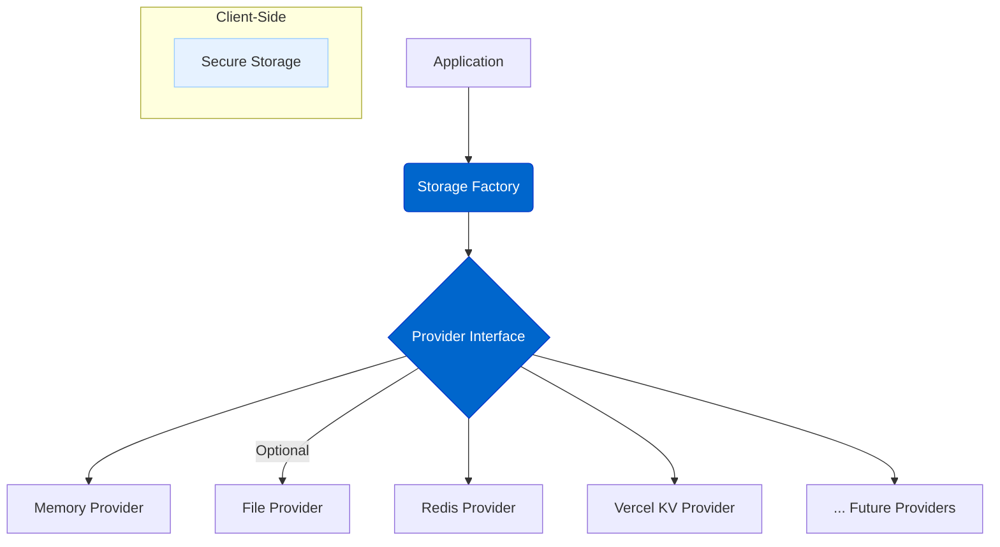
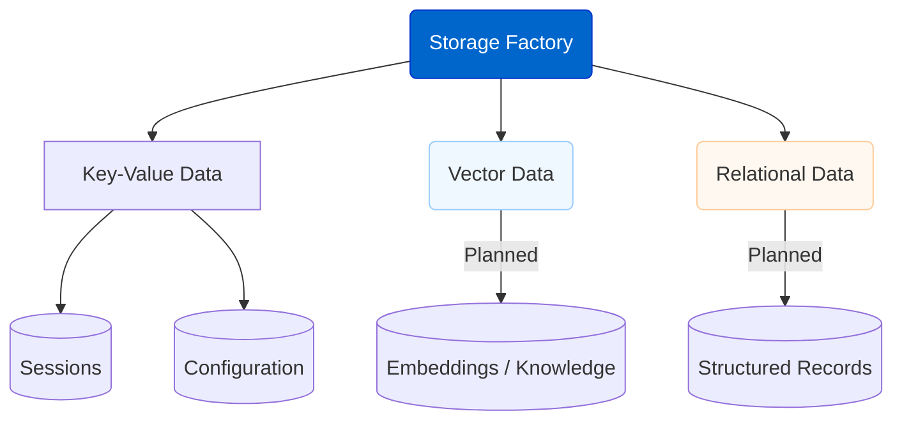

# Storage Abstraction Layer

The Storage Abstraction Layer provides a flexible system for storing and retrieving different types of data (Key-Value, Vector, etc.) using pluggable storage providers configured independently based on purpose.

## Current Status

**Status: Key-Value Core Complete, Expanding for Other Types**

The core infrastructure for Key-Value storage is stable and supports multiple backends. We are actively extending the abstraction to incorporate distinct configurations and providers for other storage types like Vector Storage.

## Feature Overview

The Storage Abstraction Layer aims to provide:

- **Multiple Storage Types**: Distinct handling and configuration for Key-Value, Vector, and potentially Relational storage needs.
- **Purpose-Specific Configuration**: Environment variables (e.g., `KV_STORE_PROVIDER`, `VECTOR_STORE_PROVIDER`) allow selecting the right backend for each storage type.
- **Standard Provider Interfaces**: Consistent interfaces for different storage types (e.g., `KeyValueStorageProvider`, `VectorStorageProvider`).
- **Pluggable Backends**: Support for various storage systems (Memory, Redis, Vercel KV for Key-Value; others planned for Vector/Relational).
- **Data Serialization**: Consistent handling of data.
- **Namespace Support**: Isolated storage spaces.
- **TTL Support**: For key-value stores requiring data expiration.
- **Secure Client-Side Storage**: A dedicated `SecureStorage` class for browser environments.

## Architecture Diagrams

### Core Provider Architecture

### Storage Types Managed

## Configuration

Storage providers are configured via environment variables specific to their purpose:

- **`KV_STORE_PROVIDER`**: Selects the backend for general key-value storage (sessions, config). Options: `memory`, `redis`, `vercel-kv`.
- **`VECTOR_STORE_PROVIDER`**: Selects the backend for vector embeddings. Options: `memory` (initially), planned: `pgvector`, `qdrant`, etc.
- **Provider-Specific Variables**: Additional variables like `REDIS_URL`, `POSTGRES_URL`, `PINECONE_API_KEY` are used based on the selected providers.

This allows mixing backends, e.g., using Redis for KV and a different system for Vectors.

## Implemented Components (Key-Value Focus)

The following components related primarily to Key-Value storage are available:

- **Key-Value Provider Interface**: The `StorageProvider` interface for KV operations.
- **Memory KV Provider**: In-memory KV store.
- **Redis KV Provider**: Redis/Upstash KV store.
- **Vercel KV Provider**: Vercel KV store.
- **Secure Storage**: Client-side encrypted storage using Web Crypto API. See `agentdock-core/src/storage/secure-storage.ts`. 
  - See [Open Source Client Implementation Notes](../oss-client/nextjs-implementation.md#client-side-storage--api-keys-byok) for security considerations regarding its use for API keys.
- **Storage Factory**: Handles instantiation of configured KV providers.
- **Namespace & TTL Support**: For KV stores.

## Available Key-Value Providers

The current version includes the following providers specifically for Key-Value storage:

1.  **Memory**: In-memory (Complete)
2.  **Redis**: Redis/Upstash (Complete)
3.  **Vercel KV**: Vercel KV (Complete)

## Integration Points

The Storage Abstraction Layer integrates with several key components:

- **Session Management**: For storing session state and history
- **Configuration Service**: For storing and retrieving API keys and user preferences
- **Tool Context**: For maintaining tool-specific state between calls
- **Memory Systems**: For storing long-term memory and context

## Benefits

This abstraction layer delivers several important benefits:

1. **Flexibility**: Easily switch storage backends based on your deployment needs
2. **Scalability**: Use distributed storage systems for high-scale deployments
3. **Simplicity**: Consistent interface regardless of the underlying storage
4. **Security**: Proper handling of sensitive data with encryption
5. **Performance**: Optimize storage based on access patterns and requirements

## Future Enhancements & Planned Providers

We plan to add support for:

- **Vector Storage Providers**: `pgvector`, `Qdrant`, `Pinecone`, `Chroma`.
- **Relational Storage Providers**: Including **SQLite** for local/development use cases and PostgreSQL.
- **Document/Blob Storage**: MongoDB, S3.
- **Caching Layer**

## Timeline

| Phase                     | Status      | Description                                      |
| :------------------------ | :---------- | :----------------------------------------------- |
| KV Provider Interface     | Complete    | Base interface for Key-Value operations defined  |
| Memory KV Provider        | Complete    | In-memory KV implementation                      |
| Redis KV Provider         | Complete    | Distributed KV storage with Redis/Upstash        |
| Vercel KV Provider        | Complete    | Native Vercel KV integration                     |
| Secure Storage            | Complete    | Client-side secure storage implementation        |
| Vector Provider Interface | Planned     | Interface definition for Vector operations       |
| Initial Vector Providers  | Planned     | Memory, pgvector integrations                    |
| Relational Providers      | Planned     | SQLite, PostgreSQL integrations                  |
| Production Testing        | In Progress | Performance testing and optimization (KV focus)  |
| Additional Providers      | Planned     | MongoDB, S3, other Vector DBs                    |

## Connection to Other Roadmap Items

The Storage Abstraction Layer is a foundation for several other roadmap items:

- **Advanced Memory Systems**: Relies on storage for persistent memory
- **Vector Storage Integration**: Uses the storage abstraction for vector data
- **Multi-Agent Collaboration**: Requires shared storage for coordination
- **AgentDock Pro**: Leverages advanced storage options for scaling

## Documentation

Once completed, we will provide comprehensive documentation on:

- How to configure and use the storage system
- How to implement custom storage providers
- Best practices for different deployment scenarios
- Performance considerations and optimization 