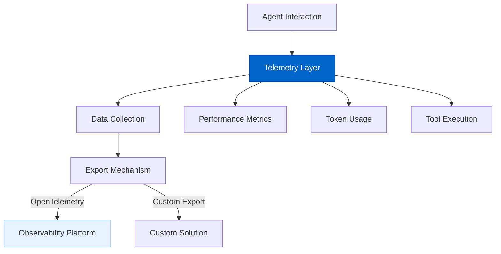
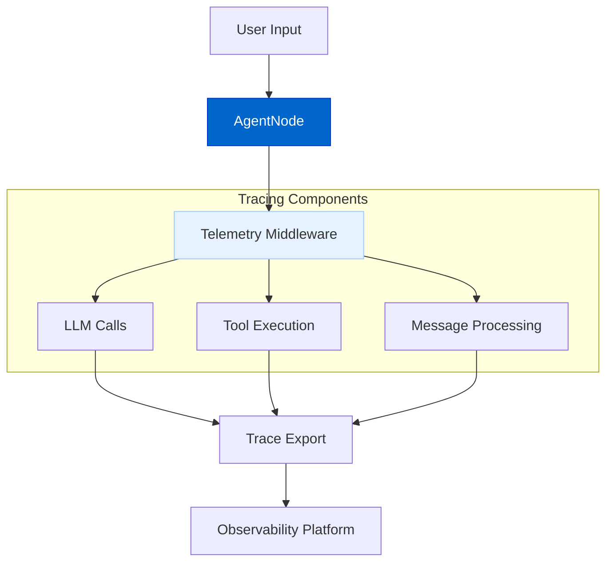
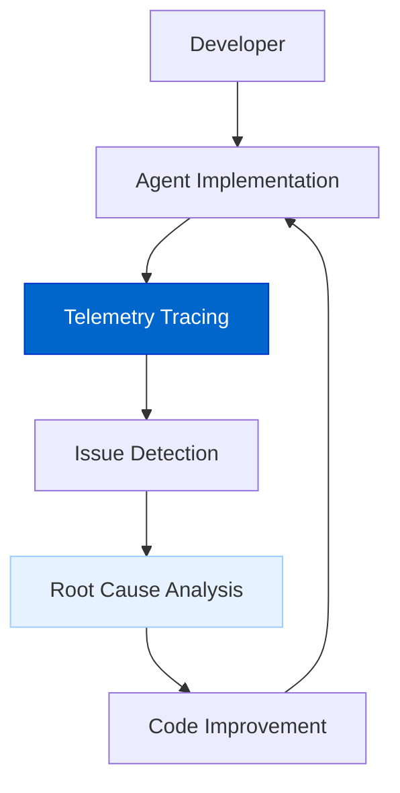
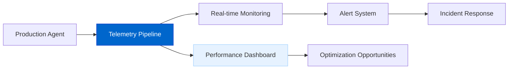

# Telemetry & Observability

The Telemetry & Observability feature provides monitoring, tracing, and evaluation capabilities for AgentDock agents, enabling developers to gain insights into agent behavior and optimize performance.

## Current Status

**Status: Planned**

We're exploring different approaches for implementing the Telemetry & Observability system, evaluating both third-party open source solutions and custom implementations. Regardless of which path we choose, the system will deliver comprehensive monitoring and tracing capabilities.

## Feature Overview

Key capabilities will include:

- **Tracing**: Track agent interactions, LLM calls, and tool executions
- **Performance Metrics**: Monitor latency, token usage, and resource utilization
- **Cost Tracking**: Measure API usage costs across providers
- **Evaluations**: Assess agent output quality with customizable metrics (see [Evaluation Framework](./evaluation-framework.md) for details)
- **Session Monitoring**: Group related interactions into sessions for cohesive analysis
- **Visualization**: Display trace data in intuitive dashboards

## Architecture Diagrams

### Telemetry Architecture

### Tracing Pipeline

### Evaluation Flow

The evaluation system is integrated with telemetry for comprehensive agent assessment. For detailed information on the evaluation architecture and components, please refer to the [Evaluation Framework](./evaluation-framework.md) document.

## Implementation Approaches

We're evaluating two main approaches:

### 1. Third-Party Integration

Using open source platforms like Laminar or OpenTelemetry-based solutions:

- Standardized tracing protocols and formats
- Pre-built visualization and analysis tools
- Lower development overhead
- Community-supported extensions

### 2. Custom Implementation

Building a tailored solution specific to AgentDock:

- Complete control over data collection and storage
- Custom visualization specific to LLM agent needs
- Tighter integration with existing AgentDock components
- Specialized features for agent evaluation

## Key Features

### Comprehensive Tracing

The system will provide detailed visibility into agent operations:

- **LLM Call Tracing**: Track prompt construction, model invocation, and response processing
- **Tool Execution Monitoring**: Log tool calls, parameters, and results
- **Message Flow Visualization**: See the complete conversation flow with timing information
- **Error Tracking**: Capture and analyze errors with full context

### Performance Metrics

Monitor and optimize agent performance:

- **Latency Breakdown**: Identify bottlenecks in the processing pipeline
- **Token Usage**: Track token consumption by component and operation
- **Resource Utilization**: Monitor CPU, memory, and network usage
- **Cost Analysis**: Calculate expenses based on provider-specific pricing

## Timeline

| Phase | Status | Description |
|-------|--------|-------------|
| Approach Evaluation | In Progress | Comparing third-party vs. custom solutions |
| Architecture Design | Planned | Core design based on selected approach |
| Basic Implementation | Planned | Initial tracing capabilities |
| Evaluation Framework | Planned | Tools for assessing agent output quality |
| Advanced Features | Future | Enhanced analytics and visualization |

## Connection to Other Roadmap Items

The Telemetry & Observability feature connects with other roadmap items:

- **Advanced Memory Systems**: Trace memory operations and retrieval effectiveness
- **Platform Integration**: Monitor cross-platform interactions and performance
- **Generalist Agent**: Track complex web-based tasks and their execution
- **Voice AI Agents**: Measure voice processing latency and quality
- **Evaluation Framework**: Provides data for the [Agent Evaluation Framework](./evaluation-framework.md)

## Use Cases

### Development & Debugging

Accelerate agent development with comprehensive tracing:

### Production Monitoring

Ensure reliability and performance in production:

### Quality Assurance

Continuously evaluate and improve agent outputs. This use case is shared with the Evaluation Framework - see the [Evaluation Framework](./evaluation-framework.md) document for more details on assessment criteria and methods.

## Technical Considerations

### Data Privacy and Security

Regardless of the implementation approach, the telemetry system will:

- Allow sensitive data masking and redaction
- Support local-only tracing for development
- Provide configurable sampling rates to control data volume
- Ensure compliance with privacy regulations

### Performance Impact

The telemetry system is designed to have minimal overhead:

- Asynchronous processing where possible
- Configurable sampling rates to reduce impact
- Batched exports to minimize API calls
- Memory-efficient trace storage

The final architecture will be determined based on further evaluation of existing open source solutions like Laminar, weighing their capabilities against the specific needs of AgentDock agents. Whether we build our own solution or leverage third-party tools, the telemetry system will provide the comprehensive observability needed to optimize agent performance and reliability. 