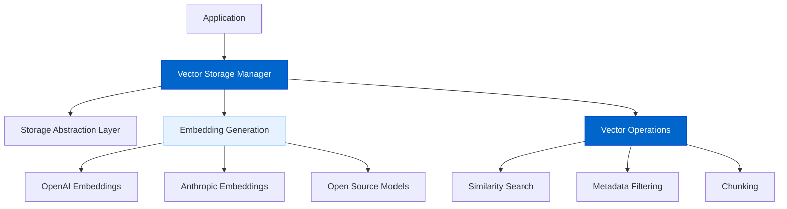
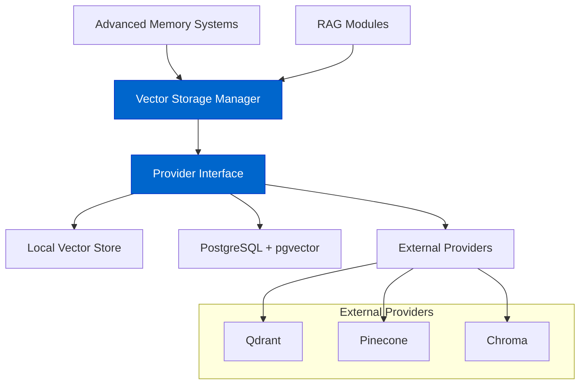

# Vector Storage Integration

Vector Storage Integration will enable embedding-based retrieval for documents, memories, and other data types, enhancing AgentDock's capabilities for contextual and semantic search.

## Current Status

**Status: In Progress**

We are actively developing the Vector Storage system as a critical component of AgentDock's advanced features, particularly for RAG (Retrieval Augmented Generation) and memory capabilities.

## Feature Overview

The Vector Storage Integration will provide:

- **Embedding Generation**: Creating vector representations of text and other data
- **Similarity Search**: Finding related content based on semantic meaning
- **Provider Abstraction**: Support for multiple vector database backends
- **Hybrid Search**: Combining vector search with traditional search methods
- **Metadata Filtering**: Filtering search results by metadata attributes
- **Chunking Strategies**: Smart document segmentation for optimal retrieval
- **Index Management**: Creating and maintaining vector indexes

## Architecture Diagrams

### Vector Storage Core Components



### Provider Interfaces and Integrations



## Implementation Details

The vector storage system includes these key components:

```typescript
// Vector storage provider interface
interface VectorStorageProvider {
  // Store vectors with their content and metadata
  store(
    vectors: number[][], 
    content: string[], 
    metadata: Record<string, any>[]
  ): Promise<string[]>;
  
  // Search for similar vectors
  search(
    query: number[], 
    limit: number, 
    filters?: Record<string, any>
  ): Promise<VectorSearchResult[]>;
  
  // Delete vectors by ID
  delete(ids: string[]): Promise<void>;
  
  // Create a new index
  createIndex(
    name: string, 
    dimensions: number, 
    options?: IndexOptions
  ): Promise<void>;
}

// Vector search result
interface VectorSearchResult {
  id: string;
  content: string;
  metadata: Record<string, any>;
  score: number; // Similarity score
}
```

## Current Implementation Status

Currently, we have implemented:

- **Interface Design**: Core interface for vector storage operations
- **Embedding Integration**: Connections to embedding model providers
- **Basic Vector Operations**: Foundation for similarity search and operations

## Supported Providers

We're implementing support for these vector database providers:

1. **Local Vector Store**: Simple in-memory vector store for development
2. **PostgreSQL + pgvector**: Production-ready vector database solution
3. **Qdrant**: High-performance vector database
4. **Pinecone**: Managed vector database service
5. **Chroma**: Open-source embedding database

## Integration with LLM Providers

The system will support multiple embedding models:

- **OpenAI Embeddings**: text-embedding-3-small and text-embedding-3-large
- **Anthropic Embeddings**: claude-3 embeddings 
- **Open Source Models**: Support for Hugging Face sentence transformers

## Dependency on Storage Abstraction Layer

The Vector Storage system builds on the Storage Abstraction Layer:

- **Storage Backend**: Uses the storage layer for persisting vector data
- **Provider Flexibility**: Leverages storage providers for different deployment scenarios
- **Metadata Storage**: Stores vector metadata through the storage layer
- **Optimized Access**: Uses specialized vector storage where available

## Connection to Advanced Memory Systems

Vector Storage is tightly integrated with Advanced Memory Systems:

- **Memory Retrieval**: Provides semantic search for memory items
- **Contextual Relevance**: Helps identify memories related to current context
- **Concept Relationships**: Identifies related concepts and information
- **Memory Embedding**: Generates and manages embeddings for memory items

## RAG Implementation

Vector Storage is a key component of our RAG (Retrieval Augmented Generation) pipeline:

1. **Document Processing**: Chunk and process documents
2. **Embedding Generation**: Create vector representations
3. **Storage**: Store embeddings with metadata
4. **Query Understanding**: Process user queries
5. **Retrieval**: Find relevant content
6. **Context Integration**: Include retrieved content in LLM context
7. **Response Generation**: Generate augmented responses

## Use Cases

Vector storage enables several key capabilities:

1. **Document Q&A**: Answer questions based on document contents
2. **Knowledge Bases**: Create searchable knowledge repositories
3. **Semantic Memory**: Store and retrieve agent memories by meaning
4. **Similarity Matching**: Find similar content or queries
5. **Content Organization**: Group related content automatically
6. **Contextual Recommendations**: Suggest relevant information

## Performance Considerations

The vector storage system is designed with performance in mind:

- **Batched Operations**: Efficient batch processing for embeddings
- **Caching**: Caching frequent queries and embeddings
- **Index Optimization**: Performance tuning for different use cases
- **Dimension Reduction**: Techniques to reduce vector dimensions while preserving meaning
- **Hybrid Search**: Combining vector search with keyword search for better results

## Future Enhancements

After the initial implementation, we plan to add:

- **Multi-modal Vectors**: Support for image and audio embeddings
- **Incremental Updates**: Efficient handling of document updates
- **Hierarchical Indexing**: Advanced indexing for improved performance
- **Cross-Encoder Reranking**: Improve result relevance with reranking
- **Sparse + Dense Vectors**: Combining traditional and neural search approaches

## Timeline

| Phase | Status | Description |
|-------|--------|-------------|
| Research & Design | Complete | Vector storage architecture and interface design |
| Interface Definition | Complete | Core provider interface specification |
| Embedding Integration | Complete | Connection to embedding model providers |
| Local Vector Store | In Progress | In-memory implementation for development |
| PostgreSQL Integration | In Progress | Integration with PostgreSQL and pgvector |
| RAG Pipeline | Planned | Complete retrieval-augmented generation system |
| External Providers | Planned | Integration with Qdrant, Pinecone, and other services |
| Advanced Features | Planned | Multi-modal support and performance optimizations |

## Connection to Other Roadmap Items

Vector Storage has strong connections to:

- **Storage Abstraction Layer**: Provides the foundation for persisting vector data
- **Advanced Memory Systems**: Enables semantic search for agent memories
- **Evaluation Framework**: Supports testing and evaluation of retrieval quality
- **AgentDock Pro**: Offers enterprise-grade vector search capabilities

## Documentation

Comprehensive documentation will cover:

- Setting up vector storage for different providers
- Implementing custom vector storage providers
- Best practices for chunking and embedding
- Performance optimization techniques
- Scaling vector storage for production use 