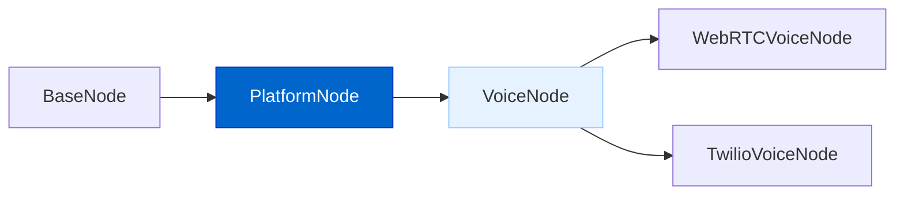
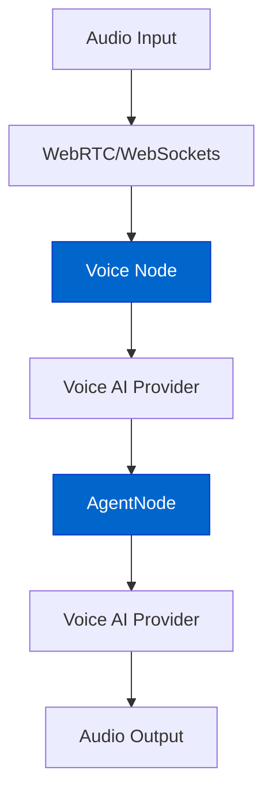
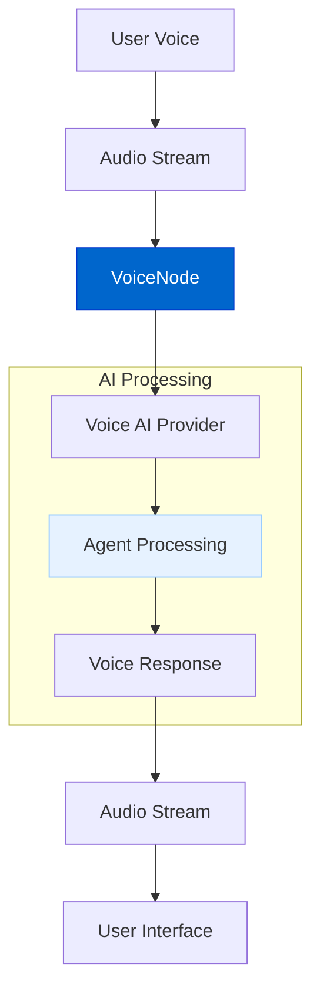
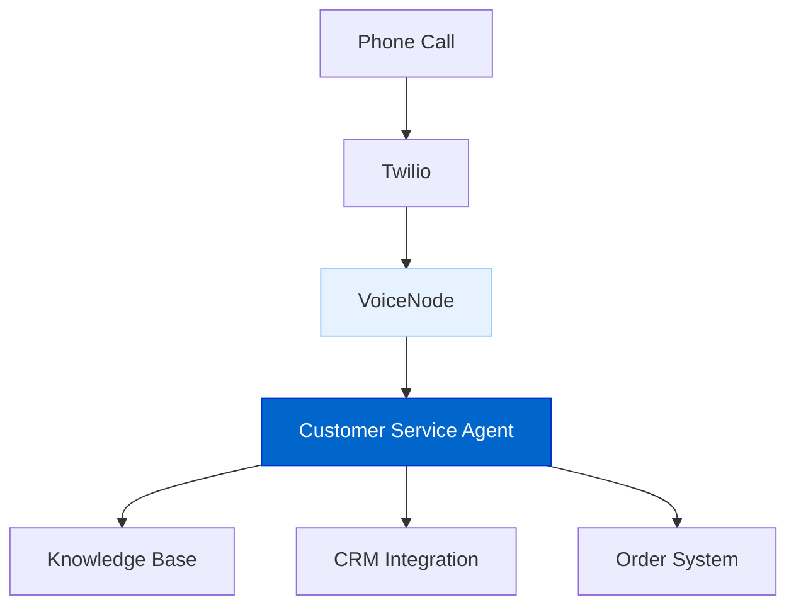

# Voice AI Agents

The Voice AI Agents feature enables real-time voice conversations with AgentDock agents through advanced speech-to-speech capabilities, creating natural, interactive experiences through web applications and phone systems.

## Current Status

**Status: Planned**

Development of the Voice AI Agents system has been designed with a focus on leveraging cutting-edge real-time speech models and integration with the existing AgentDock architecture.

## Feature Overview

The Voice AI Agents feature will provide:

- **Real-time Voice Interaction**: Near-instantaneous speech-to-speech conversations
- **WebRTC Integration**: Low-latency audio streaming for web applications
- **Phone Number Access**: Connect agents to traditional phone systems via Twilio
- **Multi-provider Support**: Flexibility to use OpenAI Realtime API, ElevenLabs, and other providers
- **Voice Node Abstraction**: Standard interface extending the PlatformNode architecture

## Architecture Diagrams

### Voice Node Architecture



### Speech Processing Pipeline



### Real-time Voice Communication



## Implementation Details

The Voice AI Agents system will be implemented with the following components:

```typescript
// Abstract class for voice-based interactions
abstract class VoiceNode extends PlatformNode {
  // Process incoming audio stream
  abstract processAudioStream(audioStream: ReadableStream): Promise<void>;
  
  // Generate speech from agent response
  abstract generateSpeech(response: Message): Promise<ReadableStream>;
  
  // Handle real-time audio session
  abstract handleAudioSession(sessionId: string): Promise<void>;
  
  // Initialize voice provider
  abstract initializeVoiceProvider(config: VoiceProviderConfig): Promise<void>;
}

// Configuration for voice providers
interface VoiceProviderConfig {
  provider: 'openai' | 'elevenlabs' | 'sesame';
  apiKey: string;
  modelId?: string;
  voice?: string;
}
```

## Voice Provider Support

The system will integrate with leading voice AI providers:

1. **OpenAI Realtime API**: End-to-end speech-to-speech with GPT-4o
2. **ElevenLabs**: High-quality voice synthesis and voice-to-voice capabilities
3. **Sesame AI**: Advanced voice models with natural conversational abilities

## Integration Methods

### WebRTC for Browser Applications

```typescript
// Example of creating a WebRTC voice node
import { createWebRTCVoiceNode } from '@/lib/voice/webrtc-factory';

// Create a WebRTC voice node with an existing agent
const voiceNode = createWebRTCVoiceNode('voice-1', agentNode, {
  provider: 'openai',
  apiKey: process.env.OPENAI_API_KEY!,
  modelId: 'gpt-4o-realtime'
});

// Set up audio stream
await voiceNode.setupAudioStream(webrtcConnection);
```

### Twilio for Phone Number Access

```typescript
// Example of creating a Twilio voice node
import { createTwilioVoiceNode } from '@/lib/voice/twilio-factory';

// Create a Twilio voice node with an existing agent
const twilioNode = createTwilioVoiceNode('phone-1', agentNode, {
  accountSid: process.env.TWILIO_ACCOUNT_SID!,
  authToken: process.env.TWILIO_AUTH_TOKEN!,
  phoneNumber: process.env.TWILIO_PHONE_NUMBER!,
  voiceProvider: {
    provider: 'elevenlabs',
    apiKey: process.env.ELEVENLABS_API_KEY!,
    voice: 'Josh'
  }
});

// Set up webhook for incoming calls
await twilioNode.setupWebhook();
```

## Key Features

### End-to-End Voice Interaction

The system leverages frontier voice AI models for seamless conversations:

- **Direct Voice Processing**: Uses provider APIs for speech-to-speech conversion
- **Continuous Streaming**: Processes audio in real-time for natural conversation flow
- **Low Latency**: Maintains responsive interactions with minimal delay

### Voice Provider Flexibility

Select the right voice technology based on your needs:

- **OpenAI Realtime**: End-to-end speech model with conversational capabilities
- **ElevenLabs**: Superior voice quality and natural-sounding synthesis
- **Sesame**: Human-like voice with natural pauses and prosody

### Phone System Integration

Connect agents to traditional phone systems:

- **Twilio Integration**: Assign phone numbers to agents
- **Outbound Calling**: Initiate calls to users
- **Inbound Support**: Receive and process incoming calls
- **Call Analytics**: Track conversation duration and metrics

## Benefits

The Voice AI Agents feature delivers several important benefits:

1. **Natural Interaction**: Voice is the most intuitive human interface
2. **Accessibility**: Provides service to users without technical expertise
3. **Multimodal Support**: Combine with text and visual responses
4. **Global Reach**: Connect through universal phone systems
5. **Enterprise Communication**: Professional voice representation

## Timeline

| Phase | Status | Description |
|-------|--------|-------------|
| Design & Architecture | Planned | Core architecture design |
| Voice Node Abstract Class | Planned | Base class implementation |
| WebRTC Integration | Planned | Browser-based voice support |
| OpenAI Realtime Integration | Planned | Initial voice provider |
| ElevenLabs Integration | Planned | Additional voice provider |
| Twilio Phone Integration | Planned | Phone number access |
| Advanced Voice Features | Future | Voice customization options |

## Connection to Other Roadmap Items

The Voice AI Agents feature connects with other roadmap items:

- **Platform Integration**: Extends the platform node architecture for voice
- **Advanced Memory Systems**: Provides context for personalized voice interactions
- **Natural Language AI Agent Builder**: Create voice-enabled agents with natural language
- **Agent Marketplace**: Share voice agent templates

## Use Cases

### Customer Service Voice Agent

Provide 24/7 voice-based customer service:



### Voice Assistant for Applications

Enhance applications with conversational voice capabilities:

