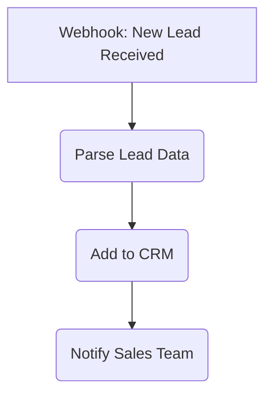
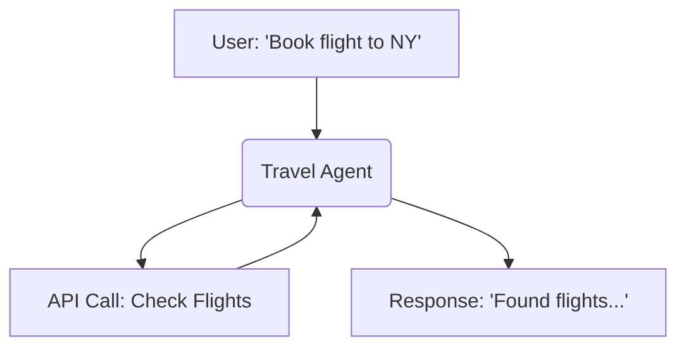
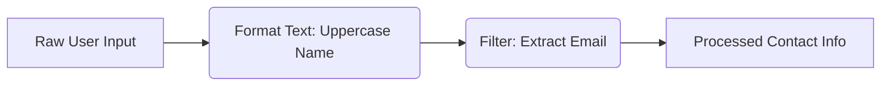
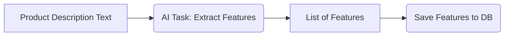
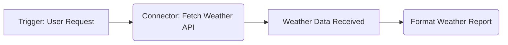
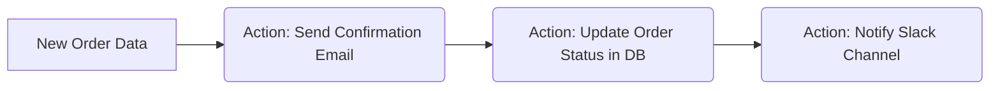
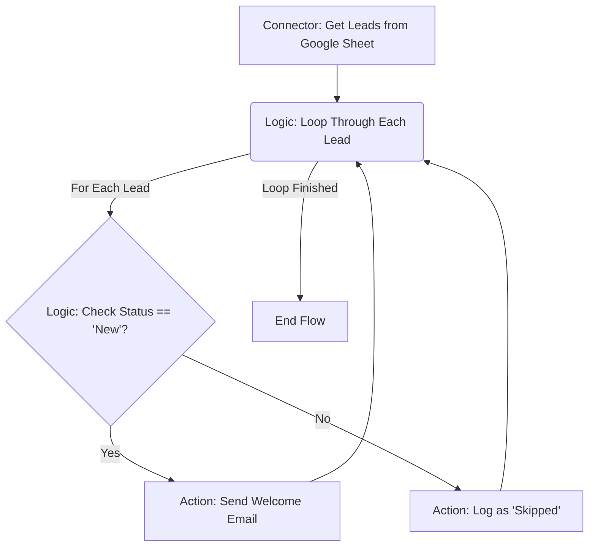

# AgentDock Workflows & Nodes: Automating Complex Tasks

AgentDock is expanding beyond conversational agents to enable the construction of sophisticated, custom automations. The goal is to allow users to orchestrate complex processes, connect diverse tools, and integrate AI logic using a structured, node-based system, reducing the need for extensive custom code for many common automation patterns.

This capability relies on a flexible **node-based architecture**. Think of nodes as specialized building blocks:
- Some initiate workflows based on **events**.
- Others **manage or transform data**.
- Some connect to **external services**.
- Others perform specific **AI tasks**.

The power comes from combining these nodes, particularly **Agent Nodes** (for conversational intelligence) and **AI Inference Nodes** (for specialized AI tasks), into structured workflows.

This document outlines the planned node types that form the core of this workflow system, providing a foundation for automating tasks ranging from data processing and customer service flows to complex research and operational decision-making.

## Development Approach: Stability First

The advanced workflow capabilities, including the visual builder and the node types detailed below, are currently under active development and refinement. Our priority is ensuring these features are thoroughly tested and proven stable in demanding, real-world production environments before releasing them more broadly.

This means we focus on achieving high standards for stability, reliability, and usability first. **AgentDock Pro provides the essential proving ground** where we can rigorously validate these complex features against diverse enterprise use cases. Once these workflow components demonstrate consistent, reliable performance and meet our internal quality benchmarks, we plan to integrate them into the open-source `agentdock-core`.

This stability-focused approach ensures that when these features become available in the core library, they are dependable and ready for production use by the open-source community.

## Planned Workflow Node Types

Workflows in AgentDock are constructed by connecting various types of nodes. Each node category serves a distinct purpose within the automation process. Here's an overview of the planned categories:

### 1. Event Nodes
   - **Purpose**: Initiate workflows based on *external triggers*, *schedules*, or *system events*.
   - **Characteristics**: Act as the starting point for automated workflows. They have outputs but no inputs and are activated by triggers (e.g., webhook, schedule, database change) rather than direct user interaction within the flow.
   - **Examples**: `Webhook Trigger`, `Time Trigger`, `Database Watcher`.

### 2. Agent Nodes
   - **Purpose**: Integrate *interactive, conversational AI* capabilities directly into a workflow.
   - **Characteristics**: Handle bidirectional communication (user input/output), maintain conversation memory/context, utilize tools, and leverage LLMs. These nodes are inherently *non-deterministic*.
   - **Examples**: `Conversational Agent`, `Customer Support Agent`, `Research Assistant`.

### 3. Transform Nodes
   - **Purpose**: Process and manipulate data as it flows *between other nodes*.
   - **Characteristics**: Accept input data, perform defined operations (e.g., formatting, parsing, filtering, calculations), and pass the results to the next node. Their effects are internal to the workflow state. Typically *deterministic*.
   - **Examples**: `Text Formatter`, `JSON Parser`, `Data Filter`, `Math Operations`.

### 4. AI Inference Nodes
   - **Purpose**: Execute specific, *non-conversational AI tasks* within a workflow.
   - **Characteristics**: Perform focused AI inference tasks like summarization or classification. Unlike Agent Nodes, they don't manage conversations. Can be *semi-deterministic* depending on configuration (e.g., temperature settings).
   - **Examples**: `Text Summarization`, `Image Classification`, `Sentiment Analysis`, `Data Extraction`.

### 5. Connector Nodes
   - **Purpose**: Interact with *external services and APIs*, primarily for **data retrieval**.
   - **Characteristics**: Integrate with third-party systems (CRMs, databases, APIs, etc.). Often handle authentication and focus on fetching data *into* the workflow.
   - **Examples**: `Google Sheets Reader`, `Salesforce Query`, `Weather API Fetcher`, `Database Connector`.

### 6. Action Nodes
   - **Purpose**: Perform operations that produce effects *outside the workflow itself*.
   - **Characteristics**: Use data from the workflow to modify external systems (e.g., sending emails, updating database records, posting to APIs). Often represent the termination point or side-effect of a workflow branch.
   - **Examples**: `Email Sender`, `Slack Notifier`, `Database Writer`, `API POST Request`.

### 7. Logic Nodes
   - **Purpose**: Control the *execution flow* and branching within workflows.
   - **Characteristics**: Determine which path(s) execution should follow based on defined conditions. Implement branching, merging, and looping constructs. Purely *deterministic*.
   - **Examples**: `Conditional (If/Else)`, `Switch/Case`, `Parallel Branch`, `Loop Construct`.

## Implementation Status & Roadmap

Developing this comprehensive node system and the associated workflow builder is a significant undertaking, currently focused within the AgentDock Pro environment. Our priority is ensuring these features are robust and reliable before wider release. We'll provide updates on the progress towards incorporating these capabilities into the open-source `agentdock-core`.