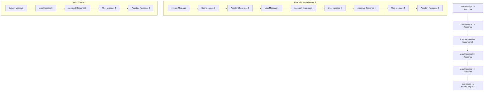

# Message History Management

This document explains how AgentDock manages conversation history to optimize context window usage while maintaining conversation coherence.

## History Policies

AgentDock supports three history policies:

| Policy | Description |
|--------|-------------|
| `lastN` | Keep the last N user messages and their corresponding assistant responses |
| `all` | Keep all messages (no trimming) |
| `none` | Remove all history (stateless conversations) |

## Message Trimming Visualization



## Implementation Details

### Message Trimming Logic

The core message trimming is handled by the `applyHistoryPolicy` function:

```typescript
export function applyHistoryPolicy(
  messages: CoreMessage[], 
  options: { 
    historyPolicy?: 'none' | 'lastN' | 'all',
    historyLength?: number,
    preserveSystemMessages?: boolean
  }
): CoreMessage[] {
  // Implementation details...
}
```

When the `historyPolicy` is set to `lastN`, the system:
1. Preserves all system messages (if `preserveSystemMessages` is true).
2. Identifies the conversation messages (excluding system messages).
3. Finds the starting point in the conversation messages that includes exactly the last `N` user messages and any subsequent assistant messages.
4. Keeps only the system messages plus the conversation messages from that calculated starting point onwards.

This approach ensures that the context sent to the LLM contains precisely the system prompt(s) and the last N turns of the user-assistant conversation.

### Special Case: historyLength=0

When `historyLength` is set to 0 and `historyPolicy` is `lastN`, the system treats this case as if `historyLength` were set to 1.
- This ensures that the last user message and any subsequent assistant responses are kept, along with system messages.
- This prevents errors caused by sending only system messages to the LLM and ensures minimal context is always provided.

## Configuration Options

AgentDock offers flexible configuration through a layered approach that prioritizes security:

### Agent Template Settings

Each agent template can specify history settings:

```typescript
{
  chatSettings: {
    historyPolicy: 'lastN', // 'none' | 'lastN' | 'all'
    historyLength: 20, // Number of user messages to keep (default: 20)
    // Other settings...
  }
}
```

### Environment Variables

Set default history settings using environment variables:

```
NEXT_PUBLIC_DEFAULT_HISTORY_POLICY=lastN
NEXT_PUBLIC_DEFAULT_HISTORY_LENGTH=20
```

### URL Parameters

Control message history settings via URL parameters:

| Parameter | Description | Valid Values | Example |
|-----------|-------------|--------------|---------|
| `historyPolicy` | The message history retention policy | `none`, `lastN`, `all` | `?historyPolicy=lastN` |
| `historyLength` | The number of user messages to retain | Any non-negative number | `?historyLength=5` |

#### Examples

- Keep all messages: `http://localhost:3000/chat?agent=demo&historyPolicy=all`
- Keep last 2 user messages: `http://localhost:3000/chat?agent=demo&historyPolicy=lastN&historyLength=2`
- Remove all history (keep 1 message): `http://localhost:3000/chat?agent=demo&historyPolicy=lastN&historyLength=0`
- Remove all history: `http://localhost:3000/chat?agent=demo&historyPolicy=none`

### Security-First Configuration Precedence

AgentDock applies settings in this order of precedence:

1. **Environment Variables** (highest security)
2. **URL Parameters** (only applied if no environment variables are set)
3. **Agent Template Settings** (default fallback)

This structure ensures server administrators can enforce security policies through environment variables that cannot be overridden by URL parameters.

## Best Practices

### Message History Optimization

- **Start Conservative**: Begin with a smaller `historyLength` (5-20) and increase if needed
- **Monitor Token Usage**: Check token counts in development console to optimize settings
- **Balance Coherence and Efficiency**: Too few messages can break context, too many waste tokens
- **Preserve System Messages**: Always keep system messages to maintain agent personality

### Security Recommendations

- **Use Environment Variables in Production**: Set `NEXT_PUBLIC_DEFAULT_HISTORY_POLICY` and `NEXT_PUBLIC_DEFAULT_HISTORY_LENGTH` in production environments to prevent URL parameter overrides
- **Set Reasonable Limits**: Excessive history retention can lead to token usage exploitation
- **Verify Using Debug Panel**: Add `?debug=true` to check the "Source" field and confirm environment variables are taking precedence
- **Consider Authorization Checks**: Implement additional authorization for history modification in sensitive deployments

## Debugging

AgentDock provides multiple ways to debug history settings:

### Console Logging

When in development mode (`NODE_ENV=development`), the system logs useful information:

```
[History] Agent example-agent history settings: {policy: "lastN", length: 20, messageCount: 22}
[History] Trimmed messages from 22 to 12
```

### Debug Panel

The debug panel (accessible by adding `?debug=true` to your URL) displays current history settings:

- **Policy**: The current history policy in use (lastN, all, none)
- **Length**: The number of messages to retain
- **Source**: Where the settings came from (environment, URL, default)
- **Messages**: Current number of messages in the conversation

This helps diagnose potential issues with message trimming and verify security precedence. 