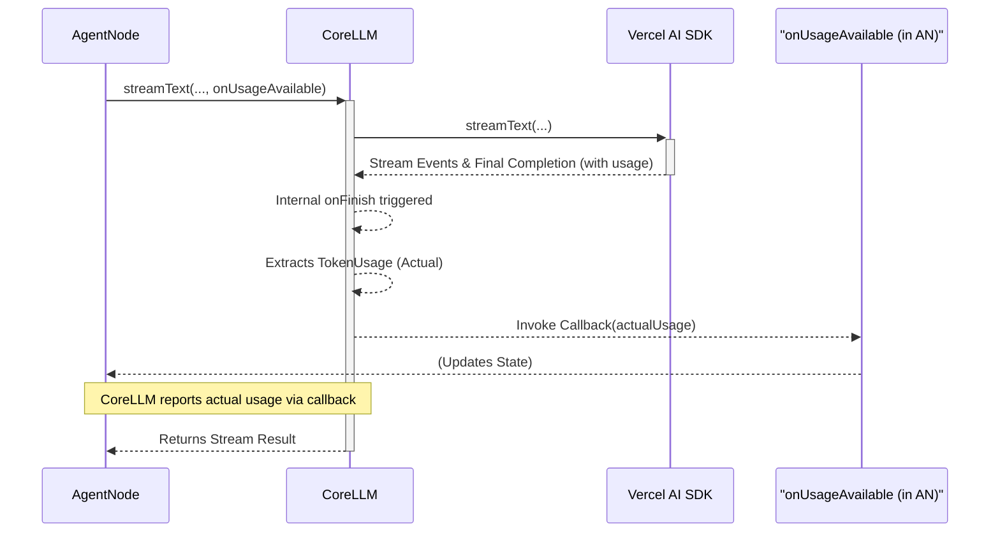
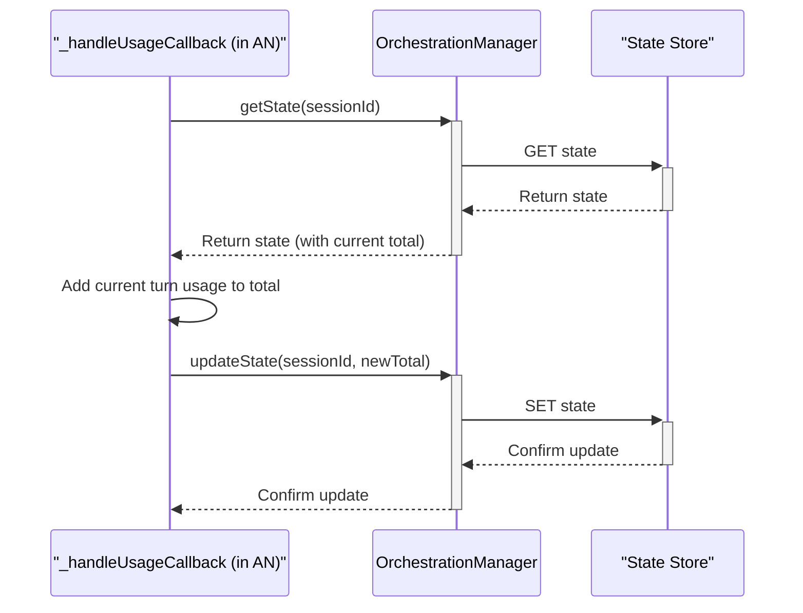
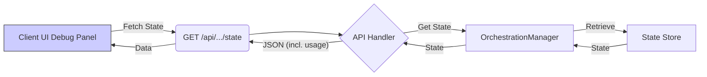
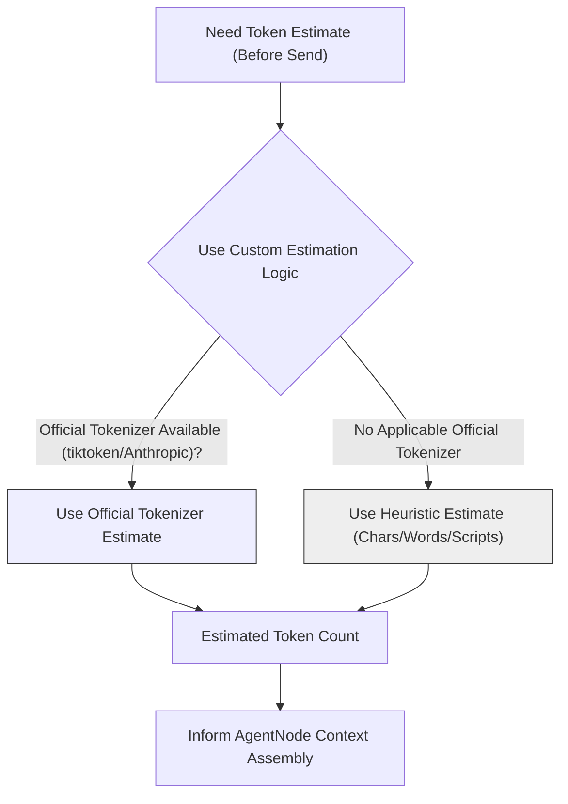
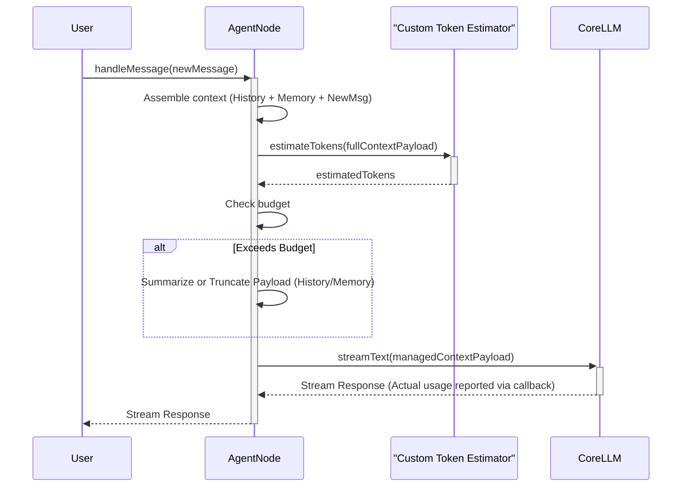

# Token Usage Tracking & Smart Context Management

AgentDock Core provides mechanisms for tracking LLM token usage and plans for advanced features to manage the context window intelligently.

## Current Implementation: Tracking Actual Usage

The current system focuses on tracking the **actual tokens consumed** during an LLM call and accumulating this count within the session state.

### 1. `CoreLLM`: Reporting Usage from AI SDK

The `CoreLLM` class interfaces with the Vercel AI SDK.

-   **Callback Mechanism:** Methods like `streamText` accept an `onUsageAvailable` callback.
-   **Extraction:** After an LLM interaction completes, `CoreLLM` extracts the `usage` data (`promptTokens`, `completionTokens`) provided by the AI SDK (if available).
-   **Invocation:** `CoreLLM` invokes the `onUsageAvailable` callback passed to it (typically by `AgentNode`), providing the `TokenUsage` for that specific turn.



### 2. `AgentNode` & State: Storing Cumulative Usage

`AgentNode` receives the actual usage report from `CoreLLM` and updates the session state.

-   **Handling Callback:** `AgentNode` provides an internal method to `CoreLLM` as the `onUsageAvailable` callback.
-   **State Update:** When the callback is invoked with the actual `TokenUsage` for the turn:
    1.  `AgentNode` retrieves the current `AIOrchestrationState` via the `OrchestrationManager`.
    2.  It reads the existing `cumulativeTokenUsage`.
    3.  It adds the received actual usage to the cumulative totals.
    4.  It saves the updated state using `OrchestrationManager.updateState()`.
-   **Stored Data:** The `cumulativeTokenUsage: { promptTokens: number, completionTokens: number, totalTokens: number }` is persisted in the `AIOrchestrationState` (e.g., Redis).



### 3. OSS Client Integration (Current Status)

-   **Debug Panel Display:** The Open Source client **currently displays** the cumulative token usage (`promptTokens`, `completionTokens`, `totalTokens`) for the active session, typically within a **debug panel** or similar diagnostic view.
-   **Data Fetching:** This is achieved by the client making an API call (likely similar to a conceptual `GET /api/session/[sessionId]/state`) to the backend. The backend retrieves the `AIOrchestrationState` using the `OrchestrationManager` and returns it, including the `cumulativeTokenUsage` field, which the client then renders.



## Planned Enhancements: Smart Context Management

Building upon the actual usage tracking, the **primary future goal** is to proactively manage context size *before* sending requests to the LLM.

### 1. Token Estimation Strategy (Planned/Conceptual)

Accurate token *estimates* are needed for pre-computation *before* an LLM call. Since the AI SDK only provides *actual* usage *after* a call, AgentDock Core must implement its own estimation logic.

-   **Custom Estimation:** Relies on utilities (like a conceptual `TokenCounter`) to estimate token counts.
-   **Methods:** This involves:
    -   Using official standalone tokenizers like `tiktoken` (for OpenAI/DeepSeek compatible models) or `@anthropic-ai/tokenizer` when available and applicable.
    -   Employing heuristic methods (based on character/word counts, script analysis for different languages like CJK, etc.) as a fallback or for unsupported models/content (e.g., code snippets, specific data formats).
-   **Goal:** Get the best possible *estimate* for the prompt payload *before* sending it.



### 2. `AgentNode`: Smart Context Assembly Logic (Planned)

`AgentNode` would use these custom token *estimates* to manage the *entire context payload* (including message history, injected memory, etc.) before calling `CoreLLM`.

-   **Configuration:** Use `ContextManagementOptions` (`maxTokens`, `reserveTokens`, etc.).
-   **Pre-computation & Pruning:** Before generating a response:
    1.  Assemble the potential context payload (system prompt, message history, relevant memory chunks, summaries, etc.).
    2.  Estimate the total tokens for this payload using the custom estimation logic.
    3.  Calculate the available budget (`maxTokens - reserveTokens`).
    4.  If `estimatedTokens > budget`:
        *   **Summarization:** Optionally summarize older parts of the history or less critical memory elements (may require internal LLM call).
        *   **Truncation:** Remove the least relevant elements (e.g., oldest messages, lowest priority memory items) until the estimate fits the budget.
-   **LLM Call:** Send only the managed, fitted context payload to `CoreLLM`.



## Downstream Applications (Enabled by Actual Usage Tracking)

While smart context management is the core driver for future development, the **current** persistent tracking of *actual* cumulative usage enables:

-   **Reporting:** Displaying usage in the client debug panel (as currently implemented).
-   **Future Cost Estimation:** Mapping actual cumulative tokens to costs.
-   **Future Budgeting/Limits:** Enforcing limits based on actual cumulative usage.
-   **Future Analytics:** Aggregating actual usage data.

*(Conceptual diagrams for Cost Estimation, Budgeting, Reporting UI remain valid for these applications based on tracked actual usage).* 

## Summary

AgentDock currently tracks **actual** LLM token usage post-call (reported by `CoreLLM` via SDK data) and accumulates it in the session state, visible in the client's debug panel. The **planned enhancements** focus on using **custom token estimation** logic (like `tiktoken` or heuristics) *before* LLM calls for smart context assembly within `AgentNode`, managing message history and memory to fit model limits. The tracked actual usage provides the data foundation for monitoring and future features like cost tracking and budgeting. 
-   **Internal Callback:** `CoreLLM` now maintains an internal callback (`_onUsageDataAvailable`). This callback can be set by consuming code (like `AgentNode`).
-   **`generateText` & `streamText` Integration:** Both methods, upon completion (in `onFinish` for streaming or after the call for non-streaming), extract the `usage` data (containing `promptTokens`, `completionTokens`, `totalTokens`) provided by the underlying LLM provider (e.g., OpenAI, Anthropic via Vercel AI SDK).
-   **Callback Invocation:** If the internal callback is set, `CoreLLM` invokes it immediately after processing a response, passing the `TokenUsage` object.

```typescript
// Simplified example from CoreLLM
private async _handleCompletion(completionResult: any, options: any) {
  // ... extract usage data ...
  const usageData: TokenUsage = { /* ... extracted tokens ... */ };

  // Invoke the internal callback if it exists
  if (this._onUsageDataAvailable) {
    try {
      await this._onUsageDataAvailable(usageData);
    } catch (error) {
      logger.error(/* ... */);
    }
  }
  
  // ... handle original onFinish or return result ...
}

// Method to set the internal callback
public setOnUsageDataAvailable(handler: ((usage: TokenUsage) => Promise<void>) | null): void {
  this._onUsageDataAvailable = handler;
}
```

## Session Persistence: `OrchestrationStateManager`

While `CoreLLM` *reports* usage per call, persistent tracking across a session is handled by the `OrchestrationStateManager`.

-   **`OrchestrationState`:** The state object managed per session includes an optional `cumulativeTokenUsage` field:

```typescript
    interface OrchestrationState extends SessionState {
      // ... other fields
      cumulativeTokenUsage?: {
        promptTokens: number;
        completionTokens: number;
        totalTokens: number;
      };
    }
    ```

-   **Update Handler:** Components like `AgentNode` are responsible for coordinating usage updates. They typically:
    1.  Define an `updateUsageHandler` function.
    2.  Set this handler on the `CoreLLM` instance using `setOnUsageDataAvailable` before making an LLM call.
    3.  The `updateUsageHandler` receives `TokenUsage` data via the callback.
    4.  Inside the handler, it retrieves the current `OrchestrationState` using `OrchestrationStateManager.getState`.
    5.  It calculates the *new* cumulative totals by adding the received usage to the existing totals in the state.
    6.  It calls `OrchestrationStateManager.updateState` to save the updated `cumulativeTokenUsage` back to the session state.
    7.  Clear the handler from `CoreLLM` after the call using `setOnUsageDataAvailable(null)`.

```typescript
// Simplified example from AgentNode or similar
async handleInteraction(...) {
  const stateManager = createOrchestrationStateManager(); // Get configured manager
  const llm = this.llm; // Get CoreLLM instance
  const sessionId = /* ... get session ID ... */;

  const updateUsageHandler = async (usage: TokenUsage) => {
    const currentState = await stateManager.getState(sessionId);
    const currentUsage = currentState?.cumulativeTokenUsage || { promptTokens: 0, completionTokens: 0, totalTokens: 0 };

    const newCumulativeUsage = {
      promptTokens: currentUsage.promptTokens + (usage.promptTokens || 0),
      completionTokens: currentUsage.completionTokens + (usage.completionTokens || 0),
      totalTokens: currentUsage.totalTokens + (usage.totalTokens || 0),
    };

    await stateManager.updateState(sessionId, { cumulativeTokenUsage: newCumulativeUsage });
    logger.debug(
        LogCategory.USAGE, 
        'UsageUpdateHandler', 
        'Updated cumulative session usage', 
        { sessionId, newTotal: newCumulativeUsage.totalTokens }
    );
  };

  // Set handler before LLM call
  llm.setOnUsageDataAvailable(updateUsageHandler);

  try {
    // Make the LLM call (e.g., streamText)
    const result = await llm.streamText(/* ... */);
    // Process result
  } finally {
    // IMPORTANT: Clear the handler afterwards
    llm.setOnUsageDataAvailable(null);
  }
}
```

## Tool Usage Tracking

This callback mechanism works seamlessly with tools that internally use `CoreLLM` (like `ReflectTool`):

1.  The tool execution logic obtains the `CoreLLM` instance and the `updateUsageHandler` (passed down through context or parameters).
2.  It sets the handler on its `CoreLLM` instance before making its internal `generateText` or `streamText` call.
3.  When the tool's LLM call finishes, the handler updates the *same* session's `cumulativeTokenUsage` via the `OrchestrationStateManager`.
4.  The handler is cleared within the tool's scope.

This ensures that token usage from both direct agent interactions and tool-invoked LLM calls are aggregated into the session's total.

## Accessing Usage Data

-   **Session State:** The primary way to access the *cumulative* usage for a session is by retrieving the `OrchestrationState` via `OrchestrationStateManager.getState(sessionId)` and accessing the `cumulativeTokenUsage` property.
-   **Debugging:**
    -   The `updateUsageHandler` typically logs the incremental updates.
    -   Individual LLM call usage might still be logged by components like `AgentNode` for immediate debugging, but this reflects only the *last* call, not the session total.
-   **API Responses:** While the previous implementation added usage for the *last* LLM call to headers (`x-token-usage`), a more accurate approach for billing or display would be to retrieve the `cumulativeTokenUsage` from the session state at the end of the request in the API route handler and potentially return *that* value (e.g., in the response body or a different header like `x-session-cumulative-token-usage`).

## Summary

Token usage tracking relies on `CoreLLM` callbacks to report usage per LLM call and the `OrchestrationStateManager` to persist the cumulative total for the entire session within the `OrchestrationState`. This provides a robust way to track usage across complex interactions involving multiple LLM calls and tool executions. 