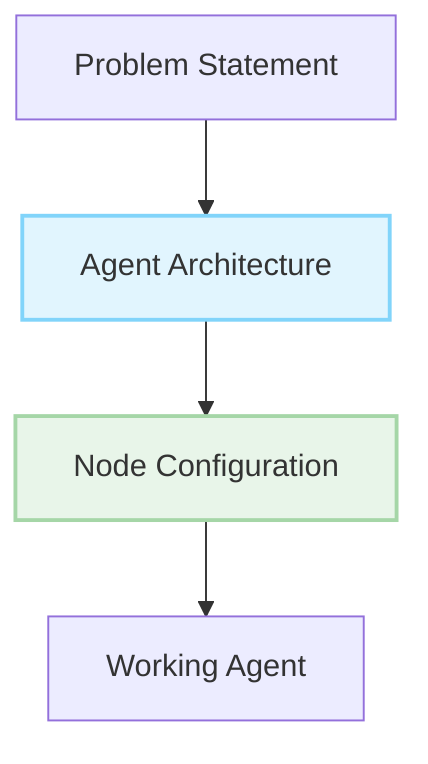

# Request For Agents (RFA)

> Build powerful AI agents with AgentDock's node-based architecture

## What are Requests For Agents?

Requests For Agents (RFAs) are specifications for AI agents that solve real-world problems using the AgentDock framework. Each RFA provides a clear problem statement, implementation guidance using AgentDock's node system, and resources to help you build an effective agent.

## Browse RFAs

    <input type="text" id="search" placeholder="Search RFAs..." />
    
    

        
        
        <label>
            <input type="checkbox" class="tag-filter" value="{{ tag }}" />
            {{ tag }}
        </label>
        
    

    
    

        
        
        <label>
            <input type="checkbox" class="status-filter" value="{{ status }}" />
            {{ status }}
        </label>
        
    

    
    

        <h2><a href="{{ rfa.url | relative_url }}">{{ rfa.title }}</a></h2>
        
{{ rfa.excerpt }}

        

            RFA-{{ rfa.id }}
            {{ rfa.status }}
            
            Has Bounty
            
        

        

            
            {{ tag }}
            
        

    

    

## Why Build These Agents?

- **Solve Real Problems**: Each agent addresses actual user needs
- **Showcase Your Skills**: Implemented agents are featured in our showcase
- **Join Our Community**: Connect with other builders
- **Get Rewarded**: Selected implementations may receive special recognition
- **Build Your Portfolio**: Create valuable systems with real-world impact

## For Non-Developers

Not a developer? You can still create these agents without code using **AgentDock Pro** - our visual agent builder lets you implement any RFA through an intuitive drag-and-drop interface and natural language instructions.

[Learn more about AgentDock Pro →](https://agentdock.ai/pro) 