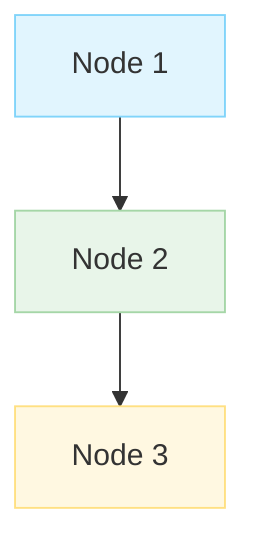

# RFA-001: Agent Title

## The Problem
[Describe the problem this agent solves]

## The Agent Solution
[Describe how an AI agent can solve this problem]

## Architecture



## Implementation Guide

### Nodes Required
- **ChatNode**: For user interaction
- **[CustomNode]**: For [specific functionality]
- **[AnotherNode]**: For [additional functionality]

### Node Configuration

```typescript
// Example configuration for the ChatNode
const chatNode = new ChatNode({
  system: "Your system prompt here",
  temperature: 0.7
});

// Example configuration for other nodes
const otherNode = new OtherNode({
  // Configuration options
});
```

### Connections

```typescript
// Define connections between nodes
const connections = [
  { from: chatNode, to: otherNode },
  { from: otherNode, to: chatNode }
];
```

## Example Conversation
**User**: [Example user input]

**Agent**: [Example agent response]

## Resources
- [Link to relevant documentation]
- [Link to useful APIs or tools]
- [Other helpful resources] 