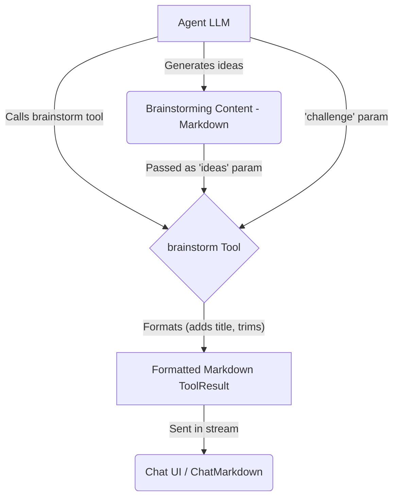

# Brainstorm Tool

The Brainstorm Tool is a cognitive enhancement tool designed to **format** structured brainstorming and creative idea generation performed by an agent. It provides a consistent presentation for ideation sessions.

## Overview

The Brainstorm Tool receives pre-generated brainstorming content from the agent and formats it for display. It expects the agent to have already performed the ideation, such as:

1. Defining or reframing the challenge
2. Generating diverse ideas and approaches
3. Organizing ideas into categories
4. Identifying promising concepts
5. Suggesting next steps

The tool itself primarily adds a standard title and ensures the content is ready for Markdown rendering.

## Usage

Include `brainstorm` in the agent's tool list (`template.json`):

```json
{
  "nodes": ["brainstorm", "think", "compare"]
}
```

When the agent decides to present its brainstorming results, it should call the `brainstorm` tool with the following parameters:

- `challenge`: A brief description of the problem or opportunity explored.
- `ideas`: The **complete, pre-generated brainstorming content** in Markdown format (including categories, lists, etc.).

### Example Agent Prompt

Instruct the agent to generate the ideas and then call the tool:

```
Brainstorm innovative ways to [solve problem/achieve goal]. Categorize the ideas and identify the most promising ones.
Once you have formulated your brainstorming session, call the 'brainstorm' tool, providing the challenge and your full list of ideas and categories as parameters.
```

## Implementation Details

1.  **Schema (`schema.ts`)**: Defines the required `challenge` and `ideas` parameters (`BrainstormSchema`, `BrainstormParameters`).
2.  **Execution Logic (`index.ts`)**: Validates parameters. On success, it takes the `ideas` text, trims it, adds a standard title (`## 💡 Brainstorm: [challenge]`), and wraps it in a `ToolResult`.
3.  **Formatting (`index.ts`)**: Formatting is done directly within the `execute` function using `createToolResult`.
4.  **Error Handling (`index.ts`)**: If validation fails or an error occurs, it throws a standard `Error`.

## Data Flow



## Output Example

The `brainstorm` tool itself produces a `ToolResult` containing Markdown like this, which is then rendered by `ChatMarkdown`:

```markdown
## 💡 Brainstorm: Ways to Improve Remote Team Collaboration

**CHALLENGE:**
Generate innovative approaches to enhance collaboration, communication, and team cohesion for distributed teams working across multiple time zones.

**IDEAS:**

🔹 **Communication Enhancements**
1. Asynchronous video standup library where team members record brief updates
2. Dedicated "virtual water cooler" Slack channel with rotating conversation prompts
3. Team radio station where members can share music during work hours
4. Browser extension that shows team member local times and working status
5. "Question of the day" that everyone answers to build personal connections

🔹 **Meeting Improvements**
1. Rotating meeting schedules that share the timezone burden equally
2. "Meeting-free Wednesdays" to ensure focus time for all team members
3. 5-minute team energizer activities at the start of important meetings
4. "Round robin" meeting facilitation to ensure diverse leadership
5. Record and transcribe all meetings with AI-generated action items

🔹 **Collaborative Workflows**
1. Shared digital whiteboard that persists between sessions
2. Collaborative documentation system with real-time co-editing
3. "Working pairs" program that rotates team members through collaborative assignments
4. Clear documentation templates for all common team processes
5. Project "mood boards" to align on creative direction asynchronously

🔹 **Team Building**
1. Virtual team retreats with shipped activity boxes
2. "Skill sharing sessions" where team members teach something non-work related
3. Remote game tournaments with small prizes
4. "Day in the life" short video series where team members share their work setup
5. Virtual "coffee dates" randomly pairing team members biweekly

**MOST PROMISING:**
* Asynchronous video standup library (combines personal connection with timezone flexibility)
* Working pairs program (builds relationships while accomplishing real work)
* Browser extension for local time/status (reduces friction in global communication)

**NEXT STEPS:**
1. Survey team members to identify current collaboration pain points
2. Prototype the asynchronous video standup approach with a small group
3. Establish clear documentation guidelines for remote-first workflows
4. Implement 2-3 team building activities before expanding to more ambitious solutions
```

(The actual rendering depends on the styles defined in `ChatMarkdown`.)

## Cognitive Tools Suite

Part of a suite including: Think, Reflect, Compare, Critique, Debate.
