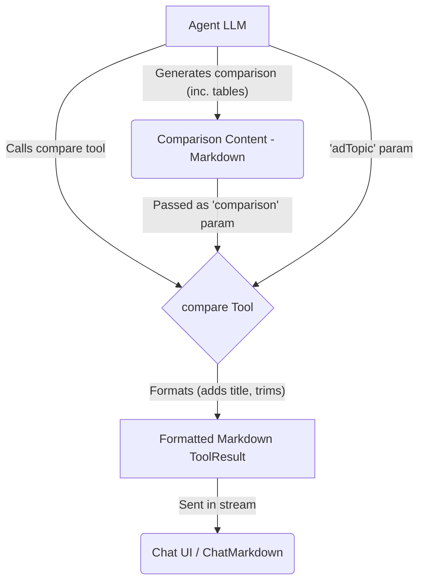

# Compare Tool

The Compare Tool is a cognitive enhancement tool designed to **format** structured comparisons generated by an agent. It helps present nuanced evaluations of multiple options, concepts, or approaches.

## Overview

The Compare Tool receives pre-generated comparison content from the agent and formats it for display. It expects the agent to have already performed the analysis, such as:

1. Defining the items being compared
2. Identifying evaluation criteria
3. Analyzing options across dimensions
4. Highlighting differences and similarities
5. Discussing trade-offs
6. Reaching a conclusion or recommendation

The tool itself primarily adds a standard title and ensures the content is ready for Markdown rendering, letting `ChatMarkdown` handle table rendering.

## Usage

Include `compare` in the agent's tool list (`template.json`):

```json
{
  "nodes": ["compare", "think", "search"]
}
```

When the agent decides to present its comparison, it should call the `compare` tool with the following parameters:

- `adTopic`: A brief description of what is being compared.
- `comparison`: The **complete, pre-generated comparison content** in Markdown format (including any Markdown tables).

### Example Agent Prompt

Instruct the agent to generate the comparison (potentially including a Markdown table) and then call the tool:

```
Compare [option A] and [option B] based on criteria X, Y, Z. Include a Markdown table summarizing the key differences.
Once you have formulated your comparison, call the 'compare' tool, providing the topic and your full comparison analysis (including the table) as parameters.
```

## Implementation Details

1.  **Schema (`index.ts`)**: Defines the required `adTopic` and `comparison` parameters.
2.  **Execution Logic (`index.ts`)**: Validates parameters. On success, it takes the `comparison` text, trims it, adds a standard title (`## ⚖️ Comparing: [adTopic]`), and wraps it in a `ToolResult`.
3.  **Formatting (`components.ts`)**: The `CompareComponent` function performs the title addition and trimming.
4.  **Error Handling (`index.ts`)**: If validation fails or an error occurs, it throws a standard `Error`.

## Data Flow



## Output Example

The `compare` tool itself produces a `ToolResult` containing Markdown like this, which is then rendered by `ChatMarkdown`:

```markdown
## ⚖️ Comparing: Serverless vs. Container-based Architectures

**DEFINE:** 
This analysis examines two cloud-native application deployment models...

**CRITERIA:**
...

**ANALYSIS:**

| Aspect | Serverless | Containers |
| --- | --- | --- |
| Cost Model | Pay-per-execution... | Pay for allocated... |
| Scaling | ✓ Automatic... | ✓ Highly scalable... |
...

**STRENGTHS & WEAKNESSES:**
...

**TRADE-OFFS:**
...

**CONCLUDE:**
Serverless is ideal for...
```

(The actual rendering, including tables, depends on the styles defined in `ChatMarkdown`.)

## Cognitive Tools Suite

Part of a suite including: Think, Reflect, Critique, Debate, Brainstorm. 