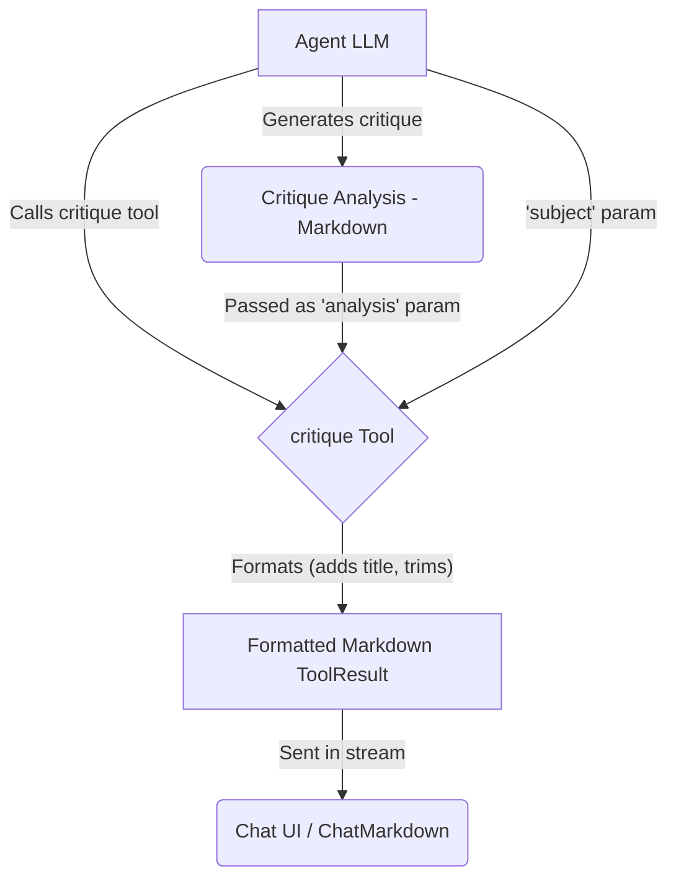

# Critique Tool

The Critique Tool is a cognitive enhancement tool designed to **format** structured critical analysis generated by an agent. It provides a consistent presentation for evaluations of code, writing, arguments, designs, etc.

## Overview

The Critique Tool receives pre-generated critique content from the agent and formats it for display. It expects the agent to have already performed the analysis, including sections like:

1. Understanding the subject
2. Identifying strengths
3. Highlighting issues/weaknesses
4. Providing actionable suggestions
5. Offering an overall assessment

The tool itself primarily adds a standard title and ensures the content is ready for Markdown rendering.

## Usage

Include `critique` in the agent's tool list (`template.json`):

```json
{
  "nodes": ["critique", "think", "search"]
}
```

When the agent decides to present its critique, it should call the `critique` tool with the following parameters:

- `subject`: A brief description of what is being critiqued.
- `analysis`: The **complete, pre-generated critique content** in Markdown format (ideally following a structure like UNDERSTANDING, STRENGTHS, ISSUES, SUGGESTIONS, ASSESSMENT).

### Example Agent Prompt

Instruct the agent to generate the critique and then call the tool:

```
Critique the following [code snippet/argument/design], identifying strengths, weaknesses, and suggestions for improvement.
Once you have formulated your critique, call the 'critique' tool, providing the subject and your full analysis as parameters.
```

## Implementation Details

1.  **Schema (`schema.ts`)**: Defines the required `subject` and `analysis` parameters (`CritiqueSchema`, `CritiqueParameters`).
2.  **Execution Logic (`index.ts`)**: Validates parameters. On success, it takes the `analysis` text, trims it, adds a standard title (`## 🔍 Critique of: [subject]`), and wraps it in a `ToolResult` using a local helper function (`CritiqueComponent`).
3.  **Formatting (`index.ts`)**: The local `CritiqueComponent` function performs the title addition and trimming.
4.  **Error Handling (`index.ts`)**: If validation fails or an error occurs, it throws a standard `Error`.

## Data Flow



## Output Example

The `critique` tool itself produces a `ToolResult` containing Markdown like this, which is then rendered by `ChatMarkdown`:

```markdown
## 🔍 Critique of: React Component Implementation

**UNDERSTANDING:**
This component is a form...

**STRENGTHS:**
1. Good separation...

**ISSUES:**
1. Missing error handling...

**SUGGESTIONS:**
1. Add validation...

**OVERALL ASSESSMENT:**
The implementation is functional...
```

(The actual rendering depends on the styles defined in `ChatMarkdown`.)

## Cognitive Tools Suite

Part of a suite including: Think, Reflect, Compare, Debate, Brainstorm.
