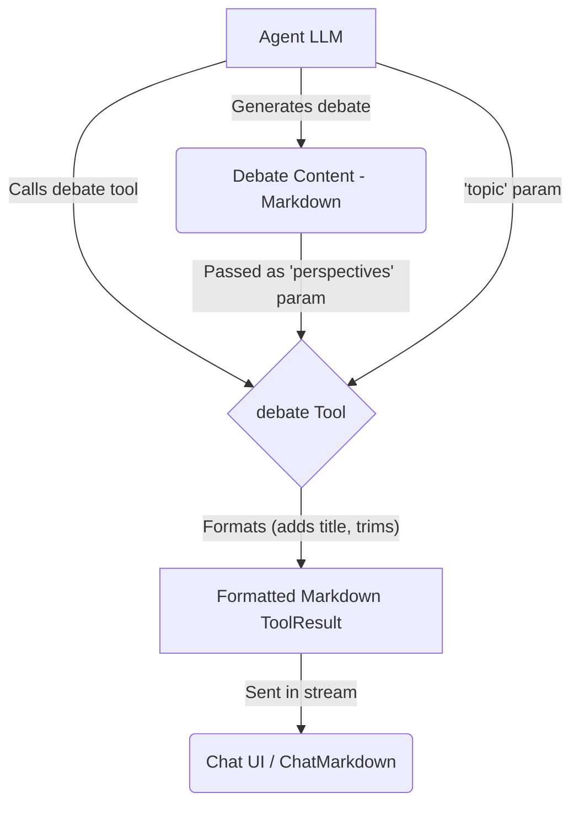

# Debate Tool

The Debate Tool is a cognitive enhancement tool designed to **format** structured multi-perspective analysis generated by an agent. It helps present nuanced explorations of complex or controversial topics.

## Overview

The Debate Tool receives pre-generated debate content from the agent and formats it for display. It expects the agent to have already performed the analysis, such as:

1. Introducing the topic and its complexity
2. Presenting diverse perspectives fairly (e.g., arguments, counter-arguments, evidence)
3. Identifying areas of agreement or synthesis
4. Concluding with a balanced assessment

The tool itself primarily adds a standard title and ensures the content is ready for Markdown rendering.

## Usage

Include `debate` in the agent's tool list (`template.json`):

```json
{
  "nodes": ["debate", "think", "compare"]
}
```

When the agent decides to present its debate, it should call the `debate` tool with the following parameters:

- `topic`: A brief description of the issue being debated.
- `perspectives`: The **complete, pre-generated debate content** in Markdown format (including different viewpoints, synthesis, conclusion, etc.).

### Example Agent Prompt

Instruct the agent to generate the debate and then call the tool:

```
Present a balanced debate on [complex topic], exploring at least three distinct perspectives with arguments and counter-arguments. Include a synthesis and conclusion.
Once you have formulated your debate, call the 'debate' tool, providing the topic and your full analysis as parameters.
```

## Implementation Details

1.  **Schema (`schema.ts`)**: Defines the required `topic` and `perspectives` parameters (`DebateSchema`, `DebateParameters`).
2.  **Execution Logic (`index.ts`)**: Validates parameters. On success, it takes the `perspectives` text, trims it, adds a standard title (`## ⚖️ Debate on: [topic]`), and wraps it in a `ToolResult`.
3.  **Formatting (`index.ts`)**: Formatting is done directly within the `execute` function using `createToolResult`.
4.  **Error Handling (`index.ts`)**: If validation fails or an error occurs, it throws a standard `Error`.

## Data Flow



## Output Example

The `debate` tool itself produces a `ToolResult` containing Markdown like this, which is then rendered by `ChatMarkdown`:

```markdown
## ⚖️ Debate on: Universal Basic Income

**INTRODUCTION:**
Universal Basic Income (UBI) represents...

### PERSPECTIVE 1: Economic Freedom Advocate
**ARGUMENTS:**
...
**COUNTER-ARGUMENTS:**
...
**EVIDENCE:**
...

### PERSPECTIVE 2: Social Welfare Proponent
...

### **SYNTHESIS:**
Areas of potential agreement...

**CONCLUSION:**
While universal basic income...
```

(The actual rendering depends on the styles defined in `ChatMarkdown`.)

## Cognitive Tools Suite

Part of a suite including: Think, Reflect, Compare, Critique, Brainstorm.
