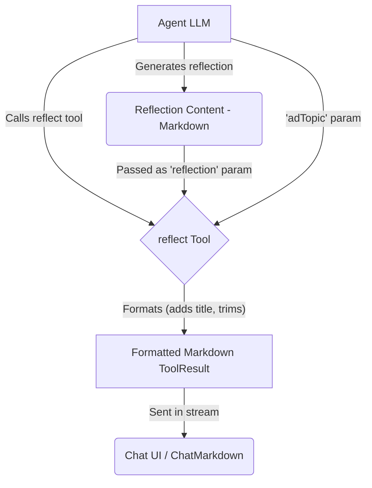

# Reflect Tool

The Reflect Tool is a specialized cognitive enhancement tool designed to **format** structured reflection and insight extraction generated by an agent. It provides a consistent presentation for metacognitive analysis.

## Overview

The Reflect Tool receives pre-generated reflection content from the agent and formats it for display. It expects the agent to have already performed the analysis, such as:

1. Analyzing a specific experience, text, or scenario
2. Extracting key insights, patterns, and principles
3. Identifying lessons learned
4. Connecting observations to broader contexts
5. Considering future applications

The tool itself primarily adds a standard title and ensures the content is ready for Markdown rendering.

## Usage

Include `reflect` in the agent's tool list (`template.json`):

```json
{
  "nodes": ["reflect", "think", "search"]
}
```

When the agent decides to present its reflection, it should call the `reflect` tool with the following parameters:

- `adTopic`: A brief description of the topic being reflected upon.
- `reflection`: The **complete, pre-generated reflection content** in Markdown format.

### Example Agent Prompt

Instruct the agent to generate the reflection and then call the tool:

```
Reflect on [experience/information/concept], extracting key insights and lessons learned.
Once you have formulated your reflection, call the 'reflect' tool, providing the topic and your full reflection analysis as parameters.
```

## Implementation Details

1.  **Schema (`index.ts`)**: Defines the required `adTopic` and `reflection` parameters.
2.  **Execution Logic (`index.ts`)**: Validates parameters. On success, it takes the `reflection` text, trims it, adds a standard title (`## 🔍 Reflecting on: [adTopic]`), and wraps it in a `ToolResult`.
3.  **Formatting (`components.ts`)**: The `ReflectComponent` function performs the title addition and trimming.
4.  **Error Handling (`index.ts`)**: If validation fails or an error occurs, it throws a standard `Error`, allowing the API route's error handler to manage it.

## Data Flow



## Output Example

The `reflect` tool itself produces a `ToolResult` containing Markdown like this, which is then rendered by `ChatMarkdown`:

```markdown
## 🔍 Reflecting on: The Evolution of DevOps Practices

**CONTEXT:**
This reflection examines how DevOps practices...

**KEY INSIGHTS:**
...

**LESSONS LEARNED:**
...

**APPLICATIONS:**
...

**REFLECTION SUMMARY:**
DevOps evolution demonstrates how technical practices...
```

(The actual rendering depends on the styles defined in `ChatMarkdown`.)

## Cognitive Tools Suite

Part of a suite including: Think, Compare, Critique, Debate, Brainstorm.