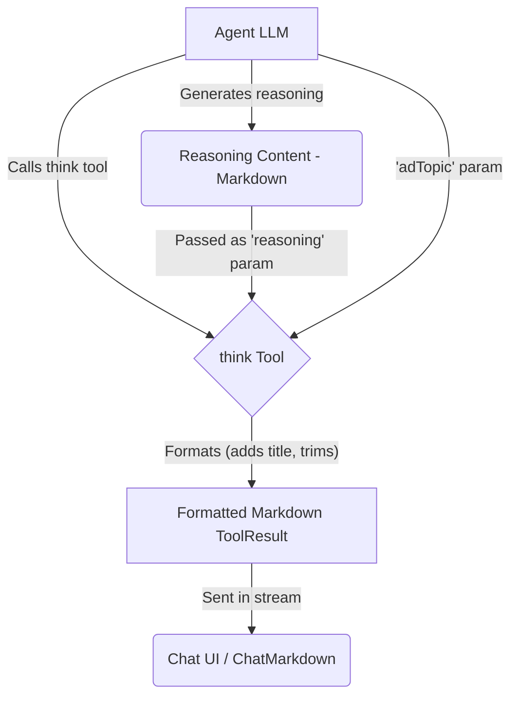

# Think Tool

The Think Tool is a specialized cognitive enhancement tool designed to **format** structured reasoning and analysis generated by an agent. It provides a consistent presentation for complex thought processes.

## Overview

The Think Tool receives pre-generated reasoning content from the agent and formats it for display. It expects the agent to have already performed the analysis, such as:

1. Defining and contextualizing the topic
2. Applying structured reasoning methods
3. Exploring multiple perspectives
4. Synthesizing insights
5. Drawing conclusions

The tool itself primarily adds a standard title and ensures the content is ready for Markdown rendering.

## Usage

Include `think` in the agent's tool list (`template.json`):

```json
{
  "nodes": ["think", "reflect", "search"]
}
```

When the agent decides to present its structured reasoning, it should call the `think` tool with the following parameters:

- `adTopic`: A brief description of the topic being reasoned about.
- `reasoning`: The **complete, pre-generated reasoning content** in Markdown format.

### Example Agent Prompt

Instruct the agent to generate reasoning and then call the tool:

```
Think through the implications of [topic/situation], considering multiple perspectives.
Once you have formulated your reasoning, call the 'think' tool, providing the topic and your full reasoning analysis as parameters.
```

## Implementation Details

1.  **Schema (`index.ts`)**: Defines the required `adTopic` and `reasoning` parameters.
2.  **Execution Logic (`index.ts`)**: Validates parameters. On success, it takes the `reasoning` text, trims it, adds a standard title (`## 🧠 Thinking about: [adTopic]`), and wraps it in a `ToolResult` for the AI SDK.
3.  **Formatting (`components.ts`)**: The `ThinkComponent` function performs the title addition and trimming.
4.  **Error Handling (`index.ts`)**: If validation fails or an error occurs, it throws a standard `Error`, allowing the API route's error handler to manage it.

## Data Flow



## Output Example

The `think` tool itself produces a `ToolResult` containing Markdown like this, which is then rendered by `ChatMarkdown`:

```markdown
## 🧠 Thinking about: Implications of Large Language Models...

**CONTEXT:**
Large Language Models (LLMs) like GPT-4...

**REASONING:**
...

**CONCLUSION:**
LLMs will likely transform software development...
```

(The actual rendering depends on the styles defined in `ChatMarkdown`.)

## Cognitive Tools Suite

Part of a suite including: Reflect, Compare, Critique, Debate, Brainstorm.