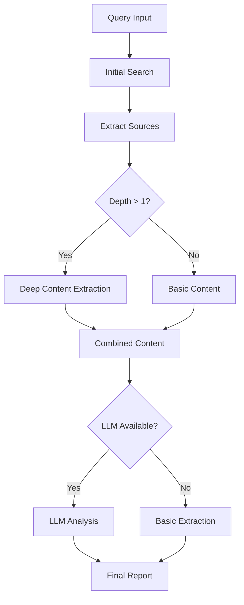

# Deep Research Tool

The Deep Research tool provides in-depth research capabilities with search and content extraction. It leverages Firecrawl for search and content retrieval, and uses LLM for generating comprehensive research reports.

## Features

- **Web Search**: Performs web searches using Firecrawl to find relevant information
- **Content Extraction**: Extracts detailed content from the most relevant sources
- **Key Findings Extraction**: Identifies the most important insights from search results
- **Structured Report Generation**: Creates well-organized research reports with key findings and sources
- **Source Tracking**: Maintains a list of all sources used in the research
- **Research Statistics**: Provides metadata about the research process

## Parameters

- **query** (string, required): The research query to investigate
- **depth** (number, optional, default: 2): Depth of research (1-3)
  - 1: Basic search only
  - 2: Basic search + content extraction from top sources
  - 3: Basic search + more extensive content extraction
- **breadth** (number, optional, default: 5): Breadth of research (3-15)
  - Controls how many sources to explore and extract content from

## How It Works

1. **Initial Search**: Performs a web search using Firecrawl based on the query
2. **Source Extraction**: Extracts sources from the search results
3. **Deep Content Retrieval**: If depth > 1, retrieves detailed content from the top sources
4. **Key Findings Extraction**: Identifies the most informative paragraphs from all content
5. **LLM Enhancement**: Uses LLM to improve the findings (when available)
6. **Report Generation**: Formats the findings into a structured report

## LLM Integration

The tool uses LLM for enhancing the research report:

- **Improved Findings**: Uses LLM to generate more coherent and informative key findings
- **Context-Aware Analysis**: The LLM analyzes the content to extract the most relevant information
- **Fallback Mechanism**: If LLM generation fails, falls back to rule-based extraction

## Example Usage

```typescript
const result = await deepResearchTool.execute({
  query: "Latest advancements in quantum computing",
  depth: 2,
  breadth: 5
}, options);
```

## Report Structure

The generated research report includes:

1. **Title**: Clear identification of the research topic
2. **Status Notes**: Optional notices about rate limits or processing issues
3. **Research Statistics**: Metadata about depth, breadth, sources analyzed, and findings extracted
4. **Key Findings**: Numbered list of significant discoveries, presented in order of relevance
5. **Sources**: List of all sources referenced in the research, with domains displayed

## Implementation Details

The implementation follows several principles:

- **Modular Design**: Uses separate components for report generation and data processing
- **Graceful Degradation**: Falls back to basic extraction if advanced features fail
- **Robust Error Handling**: Catches and reports errors at each stage of the process
- **Clear Output Formatting**: Presents findings in a clean, numbered format for easy consumption
- **Source Deduplication**: Ensures each source is only listed once in the final report

## Flow Diagram



## Recent Updates

- Improved report formatting with numbered key findings
- Added research statistics section with metadata
- Enhanced source display with domain information
- Consolidated findings into a single, well-organized section
- Better error handling and status reporting

## Integration with Agent

The tool is designed to work well with agents that want to perform research:

1. The agent can call the tool with an initial query
2. The tool returns structured findings and sources
3. The agent can analyze the findings and decide on follow-up queries
4. The agent can make additional tool calls with refined queries

This approach allows for iterative, agent-driven research rather than trying to handle all recursion internally. 